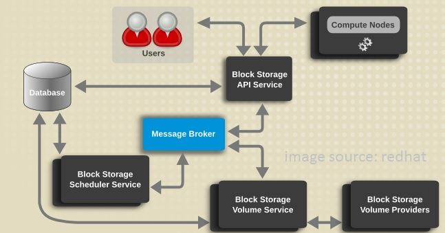
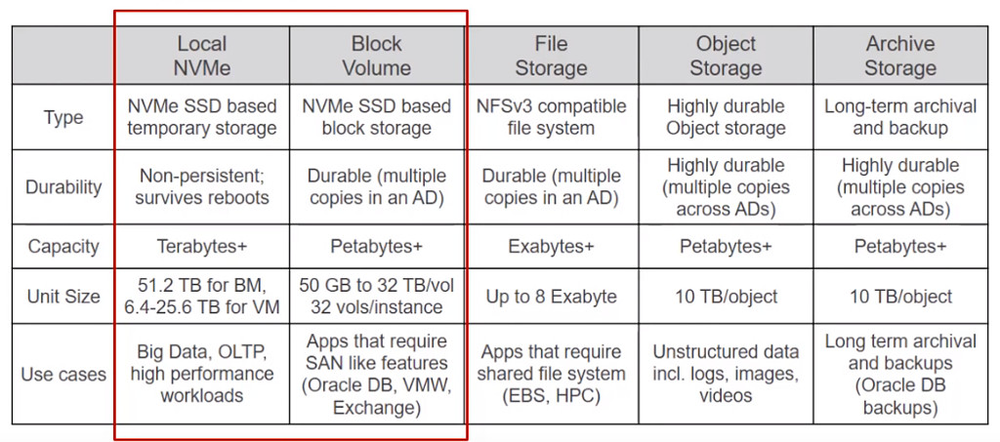
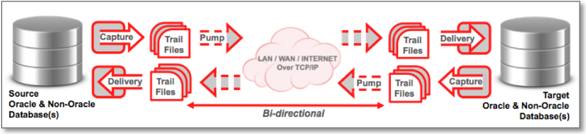
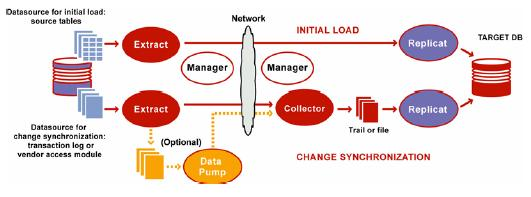
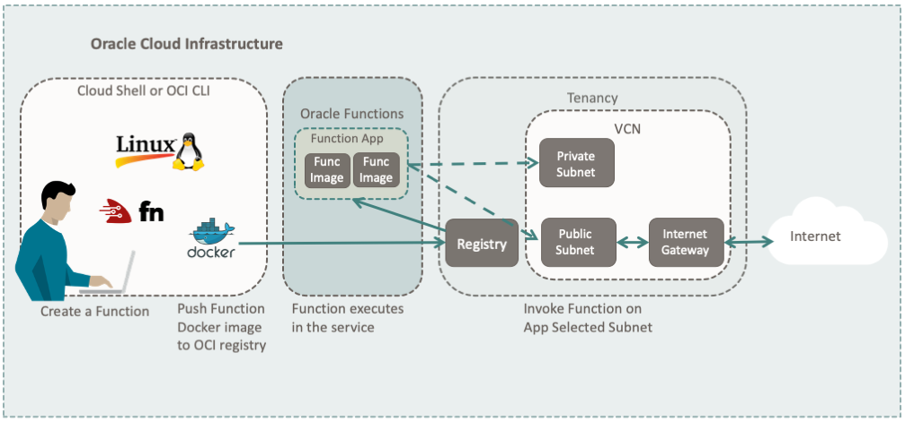
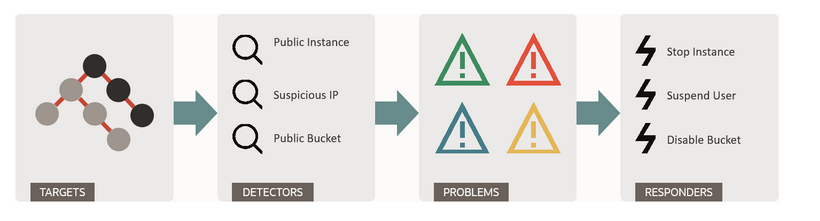
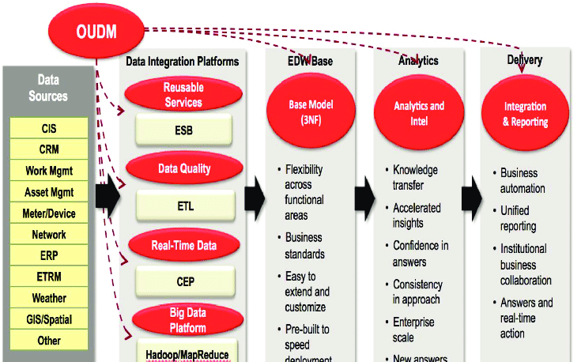
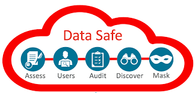

# 02 - Layanan Cloud

## Tujuan Pembelajaran

1. Mengetahui layanan yang ditawarkan cloud computing khususnya Oracle Cloud
Infrastructure (OCI).

## Hasil Praktikum

Berikut beberapa layanan yang disediakan / ditawarkan oleh cloud computing khususnya pada Oracle Infrastructure (OCI) untuk saat ini :

## 1. <b>Block Storage on OCI</b>
--> Jenis penyimpanan data yang biasanya digunakan dalam lingkungan Storage-Area-Network (SAN) yang mana data - data tersebut nantinya akan disimpan dalam volume yang juga disebut sebagai blok.
### A. Keunggulan Block Storage
1. Kinerja dan kecepatan lebih baik daripada sistem penyimpanan file storage.
2. Sangat ideal dalam penggunaan data dengan ukuran yang besar, bahkan dengan block storage akses database akan lebih cepat dan kinerja pemrosesannya pun juga sangat tinggi, terutama pada era big data dan IoT sekarang ini.
3. Masing-masng volume blok penyimpanan dapat diperlakukan sebagai disk drive yang independen dan secara langsung dikendalikan oleh sistem operasi berbasis server.
4. Block Storage banyak digunakan di likungan Storage Area Network (SAN) dengan alasan sistem transfernya sangat efisien dan bisa diandalkan dari segi kinerjanya.
5. Setiap bloknya dapat di format dengan sistem file yang dibutuhkan oleh aplikasi, contohnya seperti NFS, SMB, NTFS.

### B. Cara Kerja Block Storage
#

#
Dalam hal ini masing - masing pengguna dapat mengakses langsung block storage yang sudah di otorisasi untuk mereka.Selain itu, block storage ini juga akan berfokus pada ruang kinerja membuat, menghapus, dan menyediakan daftar informasi yang ada. Sehingga, keberadaan block storage ini dapat dikatakan sangat diperlukan perusahaan-perusahaan besar dalam analisa big data agar pekerjaan analisa selalu dapat dikerjakan dalam waktu cepat seperti dalam hitungan detik.

--> Di dalam OCI sendiri ditemukan block storage berupa, 
<b>Block Volume</b>, yang dapat digunakan untuk membuat, menghubungkan, melampirkan, memindahkan volume, serta mengubah kinerja volume sesuai dengan kebutuhan untuk memenuhi persyaratan penyimpanan, kinerja, atapaun aplikasi yang sedang dibangun.

--> Untuk melampirkan block volume ini sendiri tersedia 2 jenis, diantaranya :
1. ICSI (Internet Small Computer System Interface), mampu menghubungkan perangkat penyimpanan melalui jaringan menggunakan TCP/IP.
2. Paravirtualized, salah satu teknik virtualisasi yang menyajikan antarmuka perangkat lunak Virtual Machine yang mirip tapi tidak identik dengan perangkat keras yang mendasarinya.

-->Dalam memanfaatkan block volume ini, akan ada 3 tipe akses yang bisa dipilih oleh user untuk diterapkan di dalam instance, yaitu :
1. Read / write
2. Read / write, sherable
3. Read - only

--> Terakhir, untuk limit dan kapasitas block volume sendiri berkisar 50 GB hingga 32 TB dalam peningkatan 1 GB, sedangkan untuk secara default adalah 1 TB.

## 2. <b>Golden Gate</b>
--> Oracle GoldenGate adalah salah satu layanan oracle yang termasuk dalam kategori <b>Oracle Fusion Middleware</b> yang memberikan solusi untuk melakukan replikasi basis data pada beberapa tingkatan transaksi untuk tiap bisnis data enterprise yang telah di dukung oleh Oracle GoldenGate.

--> Peran GoldenGate sebagai layanan yang fleksibilitas, seleksi, dan transformasi terhadap :
1. GoldenGate mampu membantu bisnis yang berkelanjutan memiliki ketersediaan data yang baik.
2. Melakukan migrasi (perpindahan) basis data.
3. Membantu mengintegrasi data.
4. Sebagai Decision Support dan Data Warehouse.

--> Komponen dan Proses Dalam GoldenGate :

1. <b>GoldenGate manager process</b>, melakukan kontrol terhadap semua background proses.
2. <b>GoldenGate trail files</b>, berupa file dari data yang akan direplikasi.
3. <b>GoldenGate extract process</b>, menjalankan ektraksi data dari redo log file yang ada di database oracle.
4. <b>GoldenGate replicat process</b>, membantu proses pengambilan data melalui proses CDC (Change Data Capture) ke lingkungan database target.

--> Arsitektur GoldenGatee :

1. Extract, mengekstraksi data pada database sumber.
2. Data pumps, extract tanbahan yang dibuat sistem sumber untuk membantu meringankan kinerja extract.
3. Replicat, membaca perubahan data yang berhasil di ekstrak dan sudah mengalami spesifikasi dan konfigurasi yang kemudian akan di replikasi ke dalam database target.
4. Trail, mendukung ekstraksi yang terus menerus dalam replikasi terhadap perubahan data.
5. Checkpoint, menyimpan posisi read dan write terbaru untuk recovery.
6. Manager, mengontrol proses yang berjalan di GoldenGate.
7. Collector, proses yang berjalan pada proses background sistem target.

## 3. <b>Cloud Shell</b>
--> Cloud Shell adalah layanan yang digunakan untuk mepermudah akses resource dari OCI. Adapun benefit yang diberikan ialah :
1. Mesin ephermal yang digunakan sebagai host untuk shell Linux.
2. Ketersediaan penyimpanan untuk direktori home sebesar 5GB.

--> Tools Cloud Shell
1. OCI CLI
2. Java
3. SQL Plus
4. kubectl
5. helm
6. maven
7. gradle
8. terraform
9. ansible
10. Most OCI SDKs, including:
    - Java
    - Python
    - Go
    - TypeScript and JavaScript
    - Ruby

--> Arsitektur Cloud Shell

## 4. <b>Cloud Guard</b>
--> Cloud Guard sesuai namanya diartika sebagai layanan yang memberikan bantuan bagi penggunanya dalam memantau, mengidentifikasi, mencapai, dan mempertahankan sistem keamanan yang kuat di Oracle Cloud. 

-->Konsep Oracle Guard

Keterangan :
1. Target --> Bagian yang akan membantu menentukan hal-hal yang akan diperiksa oleh Cloud Guard. 
2. Detector --> Kemudian di bagian ini Cloud Guard akan melakukan pemeriksaan sekaligus mengidentifikasi potensi masalah keamanan yang didasarkan atas jenis dan konfigurasinya.
3. Problem --> Pada tahap ini akan terjadi pengidentifikasian masalah yang berpotensi membahayakan sistem keamanan.
4. Responder --> bagian ini meggambarkan respon atau tindakan yang akan dilakukan oleh Cloud Guard terhadap probelem yang berhasil terdeteksi.

## 5. <b>Tagging</b>
-->Layanan tagging ini bisa membantu penggunannya untuk menambahkan metadata(ingkasan detail mendasar tentang suatu data) ke dalam resources, atau bisa juga digunakan untuk mengatur dan mencantumkan resources berdasarkan kebutuhan.

-->Penggunaan Tagging di Dalam OCI
Untuk menggunakan tagging ini sendiri terbagi menjadi 2 tipe, diantaranya :
1. <b>Defined tags </b>, tag administrator yang digunakan untuk mengelola resources metadata.
2. <b>Free-form tags</b>, metadata tidak terkelola yang diterapkan ke resources oleh pengguna.

--> Jenis - Jenis Tags :
1. Tag namespace
2. Tag key
3. Tag value type
4. Tag key definition
5. Tag value
6. Free-form tag
7. Defined tag
8. Cos tracking
9. Tag variable
10. Reactivate

## 6. <b>Big Data</b> 
-->Big data ialah layanan yang diberikan oleh oracle untuk menangani kasus penggunaan data dengan jumlah besar yang terstruktur maupun tidak terstruktur demi membantu kelancaran kegiatan bisnis di dalam perusahaan besar. Layanan big data yang diberikan pun sudah dilengkapi end-to-end security, berkinerja tinggi, pengelolaan yang mudah, serta tools yang terus ter-upgrade. Kemudian, untuk biaya big data yang disediakan oleh oracle ini terbilang murah / terjangkau jika dibandingkan dengan sistem keamanan yang diberikan sangat tinggi. 

--> Arsitektur Big Data

## 7. <b>Data Safe</b>

Data Safe adalah layanan yang dirilis oleh pihak oracle untuk menyembunyikan data sensitif, menerapkan dan memantau kontrol keamanan, menilai keamanan pengguna, memahami sensitivitas data, mengevaluasi risiko data, dan memantau aktivitas pengguna dengan hanya dalam satu konsol terpadu. Hal ini tentu sangat membantu pengelolaan keamanan sehari-hari dengan tingkat yang tinggi.

--> Fitur yang diberikan pun beragam, diantaranya :
1. Fitur Penilaian Keamanan
2. Fitur Penilaian Pengguna
3. Fitur Penemuan Data
4. Fitur Penyembunyian Data
5. Fitur Audit Aktivitas.
