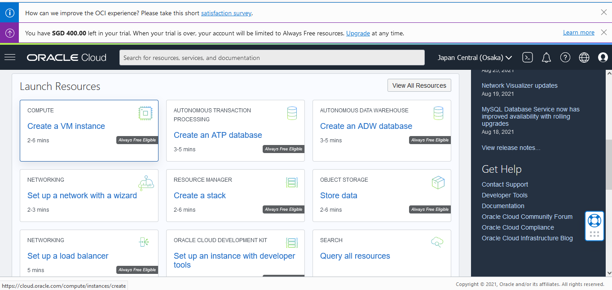
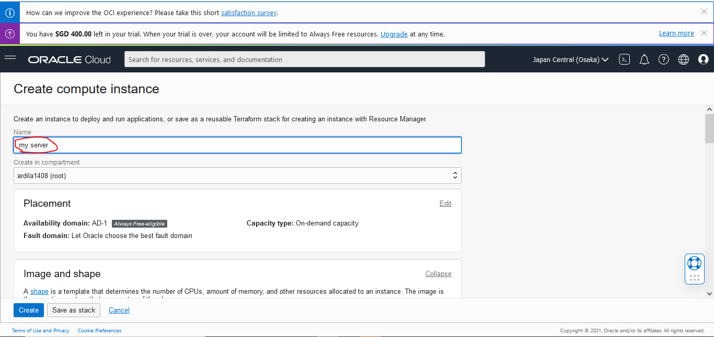
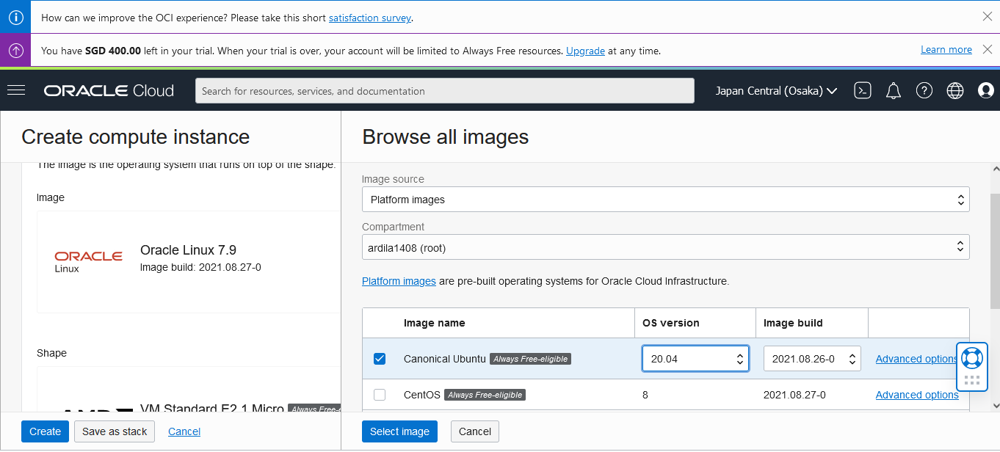
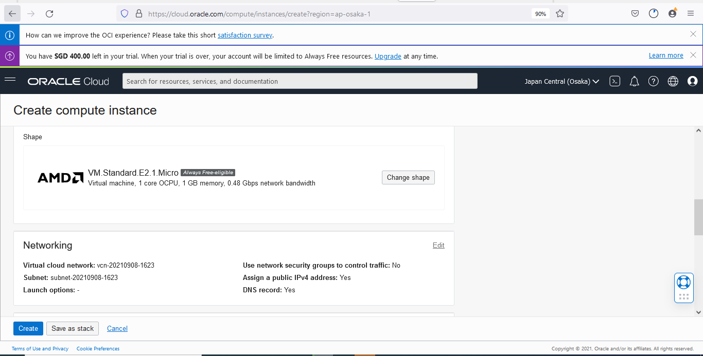
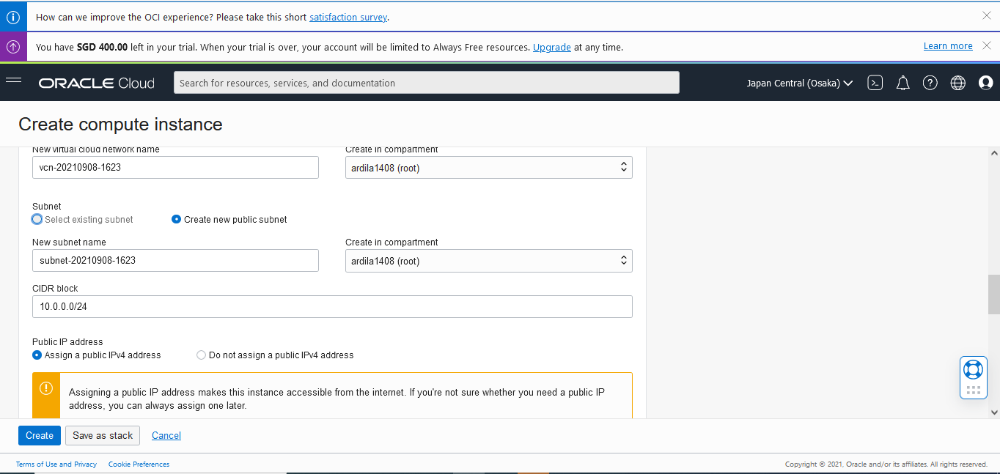
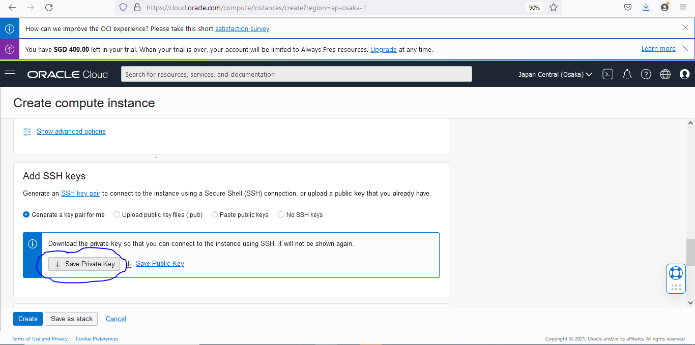
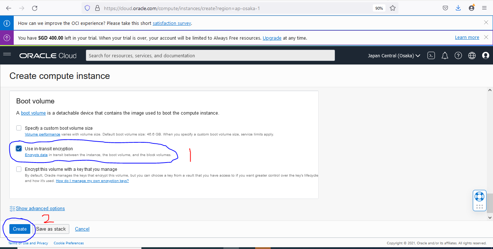
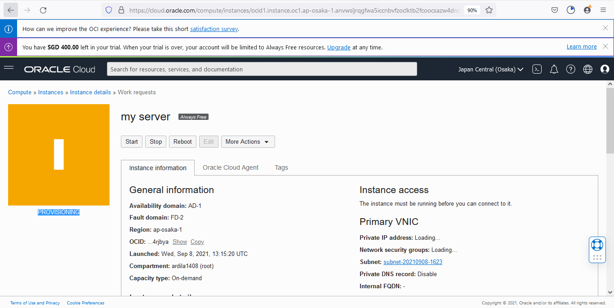
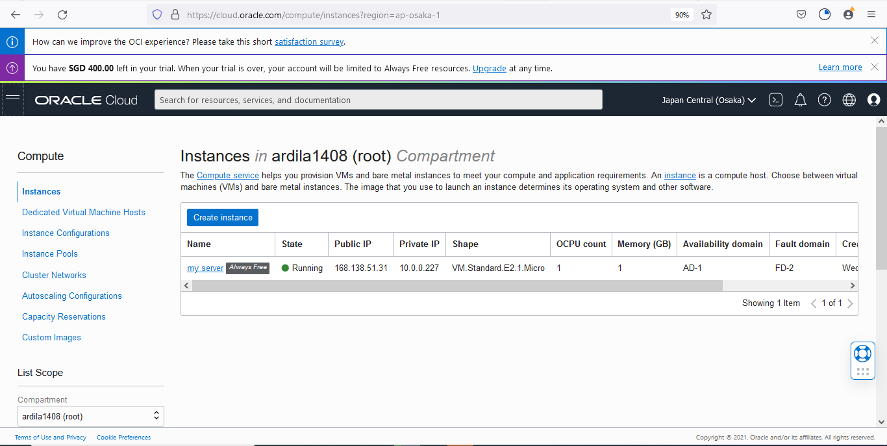

# 03 - Membuat Virtual Machine

## Tujuan Pembelajaran

1. Mengetahui proses  membuat virtual machine instance di oracle cloud.

## Hasil Praktikum

Berikut ini adalah langkah - langkah membuat virtual machine di oracle cloud :
1. Kita login terlebih dahulu ke dalam akun oracle cloud, setelah itu pada halaman dashboard oracle cloud kita pilih resource <b>Create VM Instance</b>.

2. Kita bisa masukkan terlebih dahulu nama server, disini saya memberi nama "my server"

3. Selanjutnya, kita ubah OS yang akan kita pakai nantinya dengan cara klik edit pada bagian <b>Image and Shape</b>, kemudian klik <b>Change Image</b> setelah itu baru kita ubah dari yang semula Oracle Linux versi 7.8 menjadi Canonical Ubuntu versi 20.04 terbaru dengan cara select image.

4. Kemudian untuk langkah berikutnya, di bagian shape ini kita pilih default yang sudah tersedia secara gratis (Always Free-eligible).

5. Selanjutnya, pada bagian networking kita harus pastikan Public IP Address-nya sudah Assign public IPv4 address karena jika tidak menggunakan ini kita tidak bisa mengakses server yang kita buat.

6. Setelah itu, di bagian SSH Key jangan lupa kita donwload private key yang sudah disediakan karena private key ini menjadi kunci bagi kita untuk bisa mengakses server yang telah kita buat di dalam cloud, tanpa private key ini kita tidak akan bisa mengakses server yang ada di cloud.

7. Langkah terakhir kita bisa checklist <b>Use in-transit encryption</b> yang ada di bagian Boot Volume. Setelah selesai checklist bagian tersebut, kita bisa langsung klik button <b>create</b> untuk membuat virtual machine.

8. Maka setelah klik button <b>create</b> secara otomatis virtual machine di oracle cloud berhasil dibuat dan akan secara otomatis running yang berarti bahwa virtual machine sudah siap digunakan. Berikut untuk bukti terlampir.

# Hasil Akhir 

