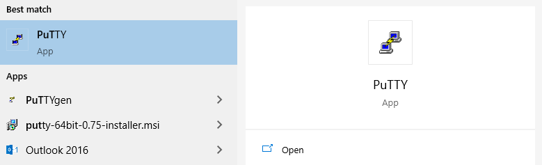
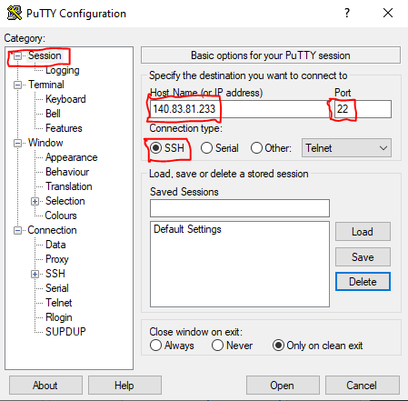
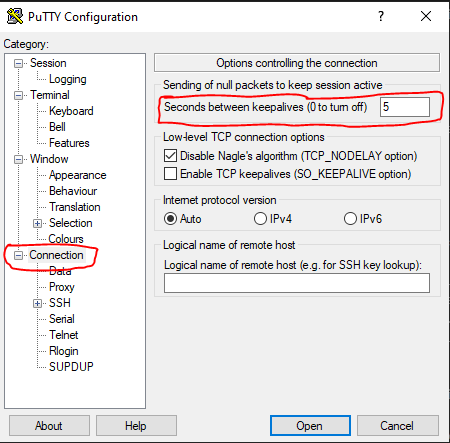
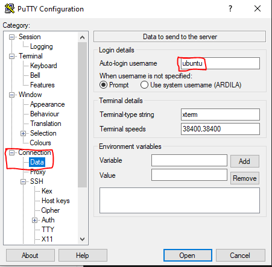
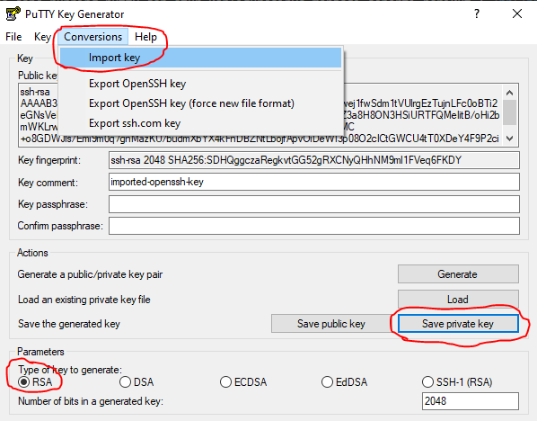
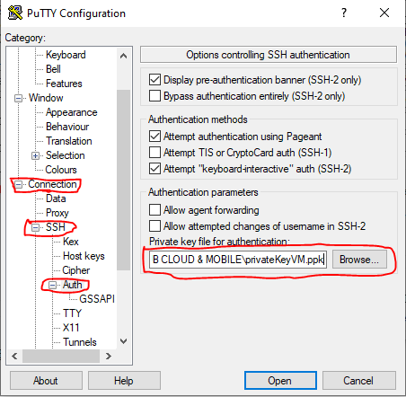
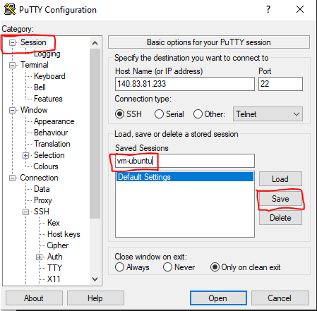
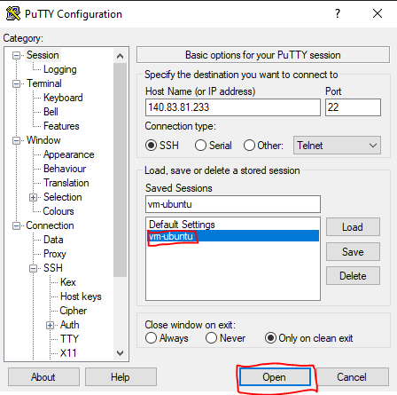
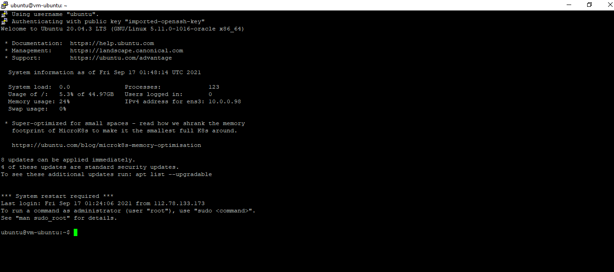

# TUGAS JOBSHEET 3

## Tujuan Pembelajaran

1. Mengetahui cara melakukan SSH ke VM Oracle Cloud atau mengkoneksikan VM yang telah dibuat di dalam Oracle Cloud.

#

## Soal 
Carilah cara agar Anda dapat melakukan SSH ke VM yang baru dibuat berdasarkan praktikum tersebut!
Lalu buatlah laporan praktikumnya!

#

## Langkah Pengerjaan 
1. Untuk malakukan SSH ke VM beberapa tools yang dibutuhkan ialah, <b> Windows, Putty sebagai klien SSH, dan juga Alamat IP dari instance yang sudah dibuat sebelumnya.</b>

2. Selanjutnya, kita bisa mulai menginstall <b>Putty</b> yang sebelumnya sudah kita download. Disini alasan kita menggunakan putty karena dia mampu membantu pengguna windows terhubung ke sistem dengan jarak yang jauh melalui internet dengan menggunakan <b>SSH</b> dan juga <Telnet</b>.

3. Untuk proses install-nya kita bisa lakukan dengan langkah yang cukup simple dengan klik next-next-install. Berikut tampilan Putty yang berhasil terinstall.   
   

4. Kemudian, kita coba running putty dan atur konfigurasinya menjadi seperti berikut :   
   

5. Langkah selanjutnya, untuk menghindari <b>timeout</b> dengan putty saat server tidak sedang digunakan, di bagian <b>Category</b> kita klik <b>Connection</b> dan tetapkan aturannya seperti gambar dibawah :   
   

6. Berikutnya, masih di menu yang sama <b>Connection</b>, kita pilih sub menu <b>Data</b> dan kita masukkan <b>Auto-login username</b> berupa <b>ubuntu</b>.  
   
<b>Noted:</b> Jika kita menggunakan layanan cloud, maka untuk bisa mengkoneksikan server dengan menggunakan ssh, username yang dipakai harus merupakan username default dari ubuntu server, yaitu <b>ubuntu</b>.   

7. Kemudian, kita coba masuk ke menu <b>Auth</b> yang ada di dalam <b>SSH</b> dan kita coba inputkan direktori file <b>Private Key</b> dari VM yang telah kita buat sebelumnya, pastikan juga file-nya sudah dalam bentuk <b>.ppk</b> dengan tujuan agar bisa terbaca / berfungsi di dalam putty.   
<b>Noted:</b> Untuk mengubah format file private key menjadi <b>.ppk</b> dapat dilakukan dengan menggunakan <b>PuTTY Key Generator</b>, seperti berikut :   
   
   

8. Untuk menyimpan semua pengaturan yang telah dilakukan, kita masukkan kode <b>DB12C-ABC</b> ke dalam <b>Saved Sessions</b> yang ada di menu Session. Jangan lupa klik <b>Save</b> untuk menyimpan.  
   

9. Setelah melakukan langkah ke-8 tadi, sekarang kita siap untuk menambahkan key private dan terhubung ke VM yang telah dibuat. Caranya :  
     - Pilih sesi yang telah disimpan sebelumnya, lalu klik <b>Open.</b>   
   

10. Maka setelah kita klik <b>Open</b>,jika konfigurasi sudah tepat dilakukan, secara otomatis instance akan terkoneksi. Berikut tampilan yang menunjukkan bahwa instance telah berhasil terkoneksi.   
   
