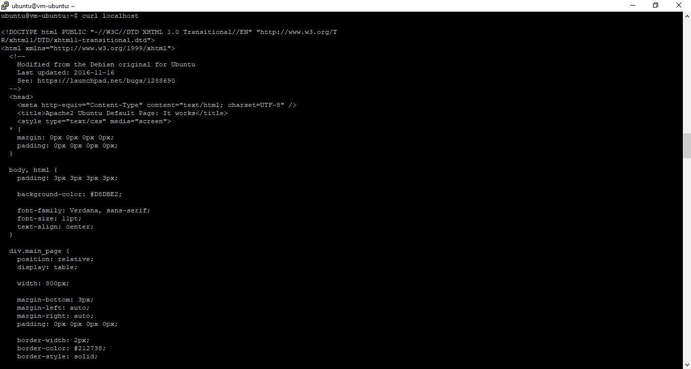

# 04 - Virtual Cloud Network (VCN) 

## Tujuan Pembelajaran

1. Mengetahui layanan Oracle Cloud Infrastructure Networking 
2. Mampu mengaktifkan port 80 melalui Virtual Cloud Network (VCN) di layanan 
Oracle Cloud 
3. Mampu memasang Apache server dan mengonfigurasi IP tables Firewalls 

## Hasil Praktikum

Berikut ini adalah langkah - langkah mengaktifkan Port 80 melalui VCN di Oracle Cloud :
1. Kita login terlebih dahulu ke dalam akun oracle cloud dengan menggunakan akun yang telah kita daftarkan sebelumnya.   

2. Setelah berhasil login, kita coba pilih menu di pojok kiri atas, lalu pilih menu Networking > Virtual Cloud Networks.   

3. Kemudian kita klik nama server tersebut dan kita akan dibawa ke halaman berikut.   

4. Setelah itu, kita pilih Security Lists di panel kiri (Resources), lalu pilih Default Security List di tabel yang tersedia. 
<b> Note : </b>  
Disini jangan lupa kita klik bagian Name  

5. Selanjutnya, Kita coba klik tombol biru <b>Add Ingress Rules</b> untuk menambahkan port.   

6. Kemudian, kita coba isikan bagian ingress rules dengan nilai-nilai seperti berikut: 
   - Stateless: Checked 
   - Source Type: CIDR 
   - Source CIDR: 0.0.0.0/0 
   - IP Protocol: TCP 
   - Source port range: (biarkan kosong) 
   - Destination Port Range: 80 
   - Description: Allow HTTP connections  

 <b> Note : </b>  

Selanjutnya, kita klik tombol <b>Add Ingress Rules</b>, sehingga sekarang koneksi HTTP telah diizinkan dan untuk VCN kita telah dikonfigurasi untuk Apache server. Hal ini juga membuktikan bahwa kita telah sukses membuat ingress rule yang berfungsi untuk membuka port 80 HTTP server serta dengan begitu VM bisa diakses oleh publik.   
   
Setelah <b>Ingress Rules</b> disimpan :   
   

#

## Hasil Praktikum

Berikut ini adalah langkah - langkah Setup Apache di VM  :

1. Buka instance melalui menu Compute > Instances, kemudian kita copy IP public VM yang ingin kita akses untuk diatur web server Apache.  

2. Melakukan akses ke VM atau server kita dengan perintah berikut ini.   

3. Setelah terkoneksi dengan VM, kita lakukan perintah berikut baris demi baris untuk menginstall Apache server.   

4. Menjalankan service Apache dengan perintah berikut.   

5. Secara default pada VM Ubuntu kita untuk firewall itu statusnya disabled (tidak aktif),  maka  kita  perlu  mengaktifkannya  dengan  melakukan  update  pada  iptabels  terlebih dahulu. Berikut untuk langkah yang bisa kita lakukan.   

6. Terakhir, Sekarang kita bisa melakukan uji server VM dengan menggunakan perintah <b>curl localhost</b> atau bisa dengan membuka browser yang ada di laptop dengan cara mengarahkan ke IP public VM yang kita miliki.Jika, berhasil akan tampil seperti gambar berikut ini. 

<b>Hasil Perintah curl localhost</b>  
  
<b>Hasil Browser</b>  
