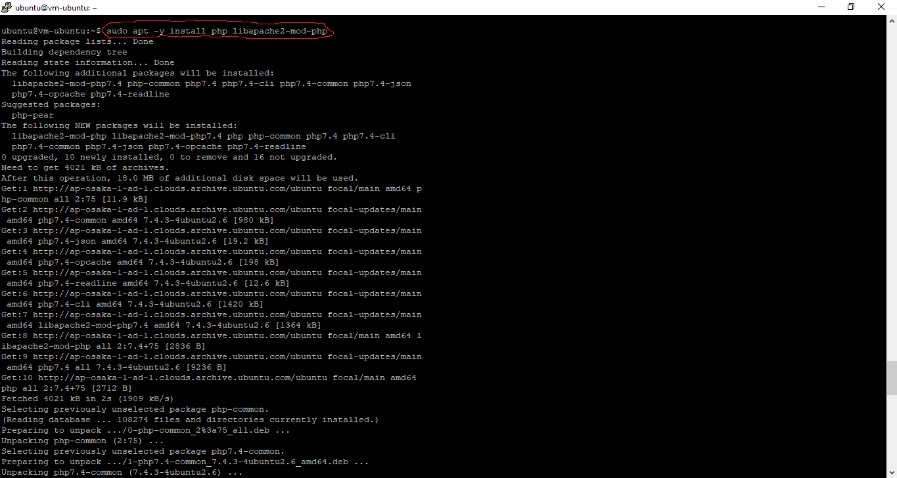

# 04 - Instalasi PHP 7

## Tujuan Pembelajaran

1. Mengetahui cara melakukan instalasi PHP 7 melalui VM Oracle Cloud

## Hasil Praktikum

Berikut ini adalah langkah - langkah melakukan instalasi PHP 7 :
1. Untuk melakukan instalasi PHP 7, hal pertama yang kita lakukan ialah menjalankan perintah berikut. Namun sebelum menjalankan perintah berikut pastikan kita sudah berhasil mengakses server atau VM yang sudah kita buat.    

2. Kemudian, kita coba untuk memverifikasi proses intalasi yang sebelumnya telah dilalukan dan sekaligus mencoba untuk restart apache.    

3. Berikutnya, kita tambahkan test file PHP ke dalam instance kita dengan cara menjalankan perintah berikut.   

4. Selanjutnya, kita tambahkan syntax berikut ke dalam file yang sudah berhasil dibuat, lalu kita save.   

5. Terakhir, kita coba koneksikan IP VM yang kita punya. Jika berhasil, maka akan muncul tampilan seperti di bawah ini pada browser yang kita gunakan. Alamat URL <b>Connect to http://<your-public-ip-address>/info.php</b>  

<b>Noted:</b>
Pada halaman browser tersebut tampil informasi mengenai daftar konfigurasi PHP.