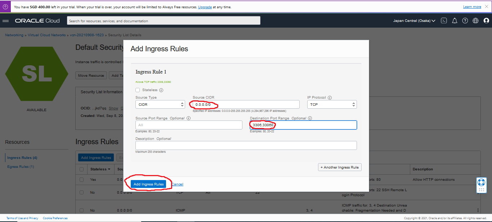
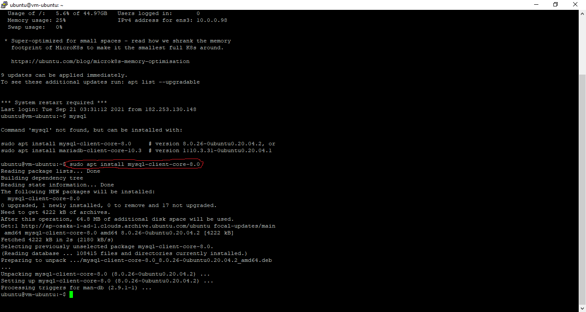

# 05 - PAAS -> Install MySQL

## Tujuan Pembelajaran

1. Mengetahui layanan yang ditawarkan cloud computing khususnya Oracle Cloud 
Infrastructure (OCI).

## Hasil Praktikum

Berikut ini adalah langkah - langkah yang dilakukan untuk menginstall MySQL melalui layanan PAAS Oracle Cloud :
1. Kita login terlebih dahulu ke dalam akun oracle cloud dengan menggunakan akun yang telah kita daftarkan sebelumnya.   

2. Setelah berhasil login, kita coba pilih menu MySQL yang ada di dalam database.   

3. Kemudian kita buat MySQL DB system. Terlihat pada bagian pertama akan tampil Provide DB System Information.  

4. Setelah itu, kita buat administrator credentials. Disini kita coba isikan username dan juga password.  

5. Selanjutnya di bagian konfigurasi networking, kita sesuaikan dengan default (yang telah disediakan oracle cloud).   

6. Begitu juga di bagian configure placement kita juga sesuaikan dengan default yang telah disediakan.  
   

7. Di bagian berikutnya akan terlihat bagian configure hardware, disini akan tampil informasi terkait CPU Core Count, Memory Size, dan juga Data Storage Size. Berikut untuk detailnya :  
   

8. Selanjutnya, untuk configura backup plan bagian backup retention period kita sesuaikan defaultnya yang bernilai 7.  
   

9. Setelah ke-8 langkah diatas selesai dilakukan, kita coba create, maka tampilannya akan seperti berikut :  
   

10. Sebelum lanjut ke langkah berikutnya, kita tunggu MySQL yang kita buat sampai berstatus active.  
   

11. Kemudian, kita coba masuk ke menu Virtual Cloud Networks yang ada di menu Networking.  
   

12. Di halaman Virtual Cloud Networks Details,kita coba masuk ke menu Security List.  
   

13. Di bagian Security List, kita coba buka Default Security List yang sudah tersedia. Untuk detailnya kita bisa lihat bagian berikut :   
  

14. Dimana setelah klik bagian Default Security List, kita akan dibawa ke halaman Ingress Rules. Di bagian inilah kita bisa membuat Ingress Rules baru. Untuk detail konfigurasi Ingress Rules, kita bisa lihat bagian berikut.  
  <
   

15. Setelah itu, kita coba untuk login ke dalam VM yang telah kita buat sebelumnya melalui putty. Kemudian setelah berhasil masuk, kita coba install MySQL di dalam VM kita dengan menggunakan perintah berikut :  
   

16. Kemudian, kita coba hubungkan VM database kita dengan VM oracle dengan menggunakan private key dari VM database. Berikut untuk detail perintahnya :  
   

17. Setelah semua proses instalasi diatas selesai, sekarang kita coba untuk menginstal Wordpress pada PaaS. Dimana langkah pertama yang kita lakukan ialah membuat database baru, berikut untuk perintah yang harus dijalankan.  
   

18. Baru kemudian kita download Wordpress Pada Folder /var/www/html dengan perintah berikut.  
   

19. Jangan lupa setelah itu kita ekstrak Wordpress yang ada pada folder /var/www/html dengan perintah <b>tar zxvf latest.tar.gz</b>, maka proses yang berjalan akan seperti berikut.  
   

20. Selanjutnya, jika proses estrak file hasil download berhasil, kita bisa menghapus file hasil download dengan menggunakan perintah berikut.  
   

21. Selanjutnya, kita akan menginstall extension mysql pada php dan mengaktifkannya pada <b>php.ini</b>. Berikut adalah perintah untuk menginstall extenstion mysql pada php.   
   

22. Kemudian, kita coba akses file php.ini dan kita lakukan modifikasi seperti yang ada di dalam modul, yang mana fungsinya untuk mengaktifkan extension mysql pada php.  
   
   

23. Setelah semua proses diatas berhasil dilakukan, sekarang kita coba lakukan restart apache sekaligus setting ownership dan permissions dengan menggunakan perintah berikut.  
   

24. Setelah semua proses diatas berhasil dilakukan, sekarang kita coba lakukan restart apache sekaligus setting ownership dan permissions dengan menggunakan perintah berikut.  
   

25. Selanjutnya, kita akan melakukan proses Intalasi Wordpress melalui browser(http://168.138.51.31/wordpress). Berikut untuk step - stepnya.
#
1. Kita harus memilih terlebih dahulu bahasa untuk digunakan di dalam Dashboard Wordpress. 

#

