# 04 - Instalasi PHP 7

## Tujuan Pembelajaran

#
1. Mengetahui cara melakukan upload aplikasi ke VM Oracle Cloud serta cara membuat database-nya.

#
## Hasil Praktikum
#

1. Upload project php yang kita miliki ke dalam server (VM Oracle Cloud). Disini file project akan disimpan di dalam direktori "/var/www/html", karena file project ada di dalam github, maka proses upload project ke server dilakukan dengan cara clone.  
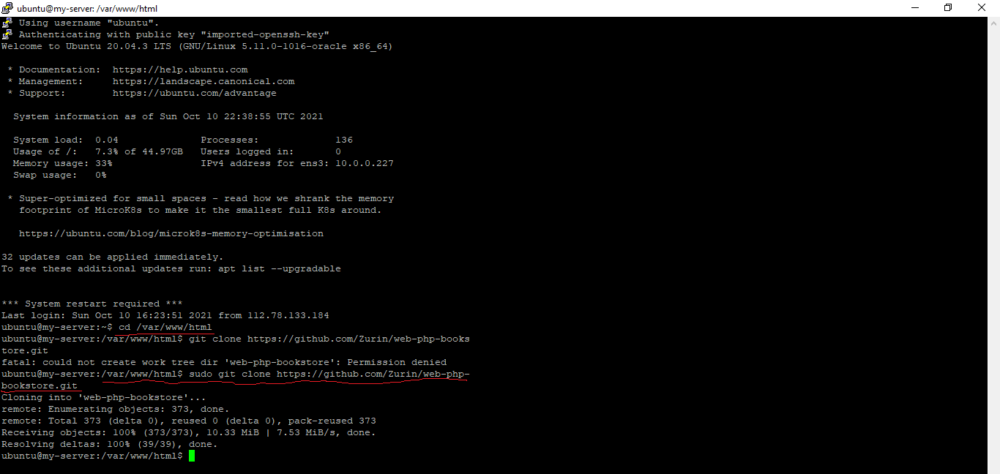   

2. Sekarang kita coba cek file - file yang berhasil tersimpan di dalam direktori "/var/www/html/web-php-bookstore". Disini terlihat beberapa file project php dan juga database bernama db_buku.  
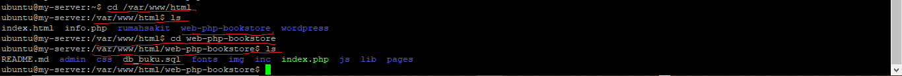   

3. Kemudian, kita coba koneksikan project file kita dengan database mysql.  
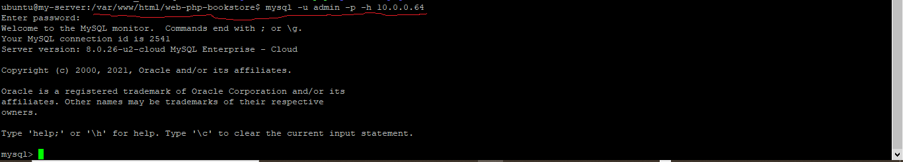   

4. Selanjutnya, kita buat database baru dengan nama <b>db_buku</b> di dalam mysql.  
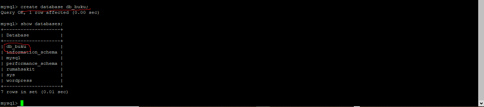   

5. Sebelum lanjut ke langkah berikutnya, kita berikan hak akses secara penuh terlebih dahulu kepada user <b>admin</b> dalam mengakses database <b>db_buku</b> dengan menjalankan perintah berikut.   
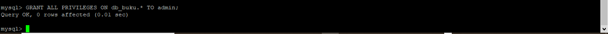   

6. Kita coba lakukan import database dengan menggunakan file db_buku.sql ke dalam database yang baru saja kita buat, yaitu db_buku.sql   
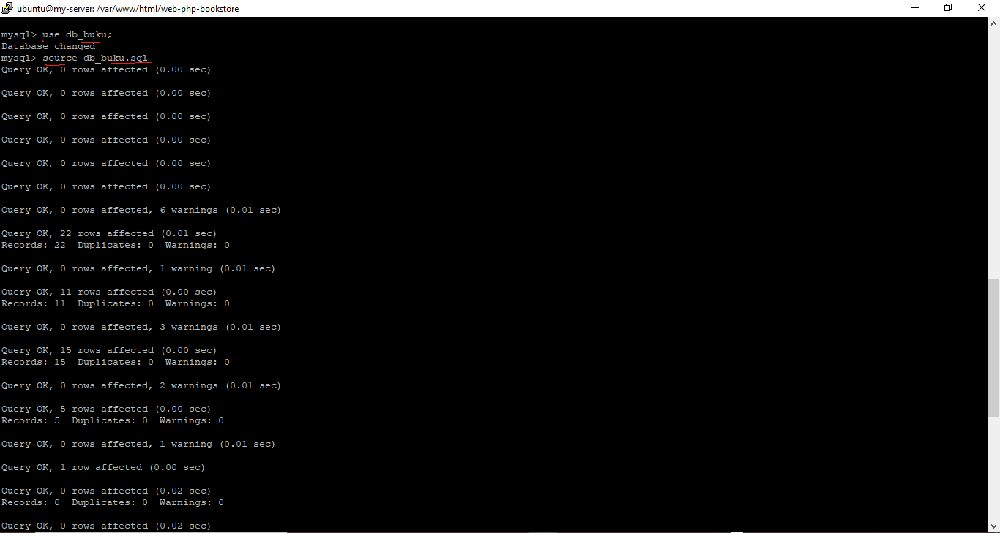   

7. Untuk membuktikan bahwa proses import berhasil dilakukan, kita coba cek dengan menjalankan perintah berikut.   
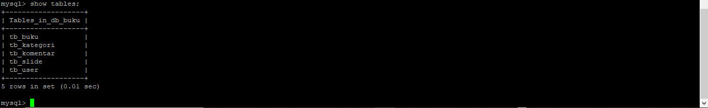   

8. Kemudian kita setting koneksinya dengan cara mengedit file koneksi.php menjadi seperti berikut.   
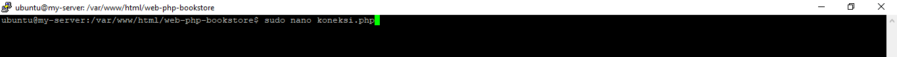   

9. Disini kita sesuaikan servername, username, password, dan database-nya dengan mysql yang sudah kita install.   
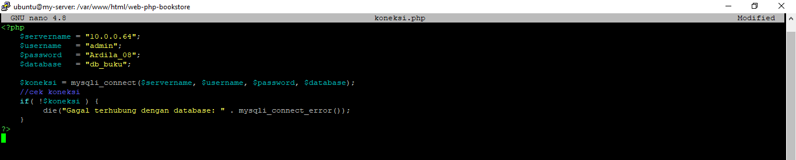   

10. Terakhir, kita coba jalankan browser. Maka, jika berhasil akan tampil sistem website kita.  
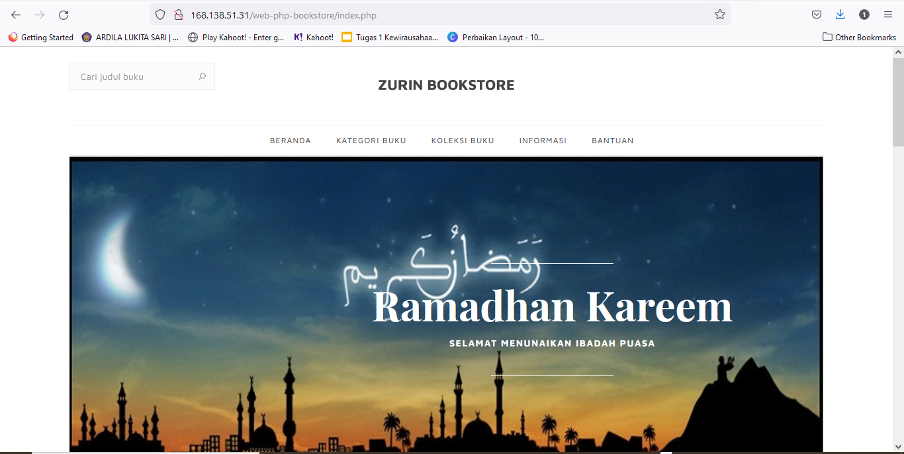   
   
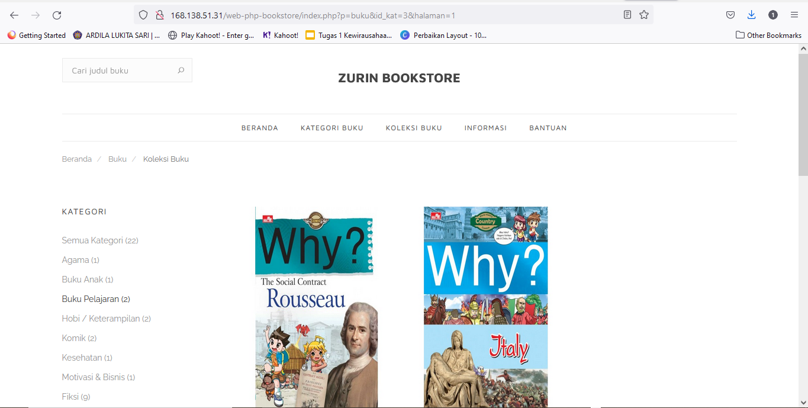   

