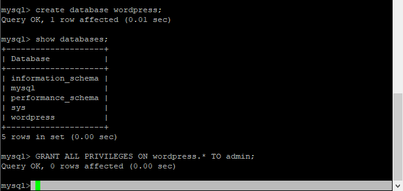
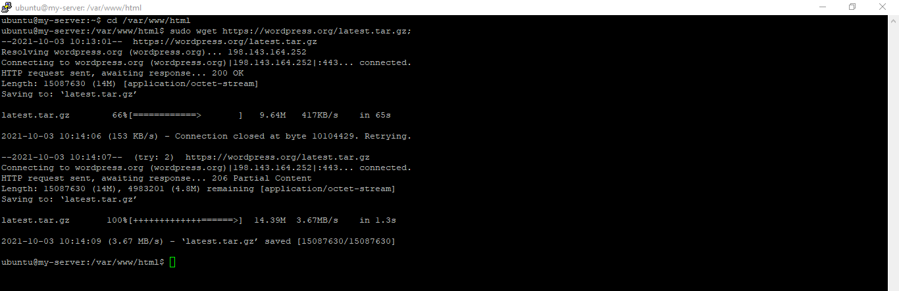
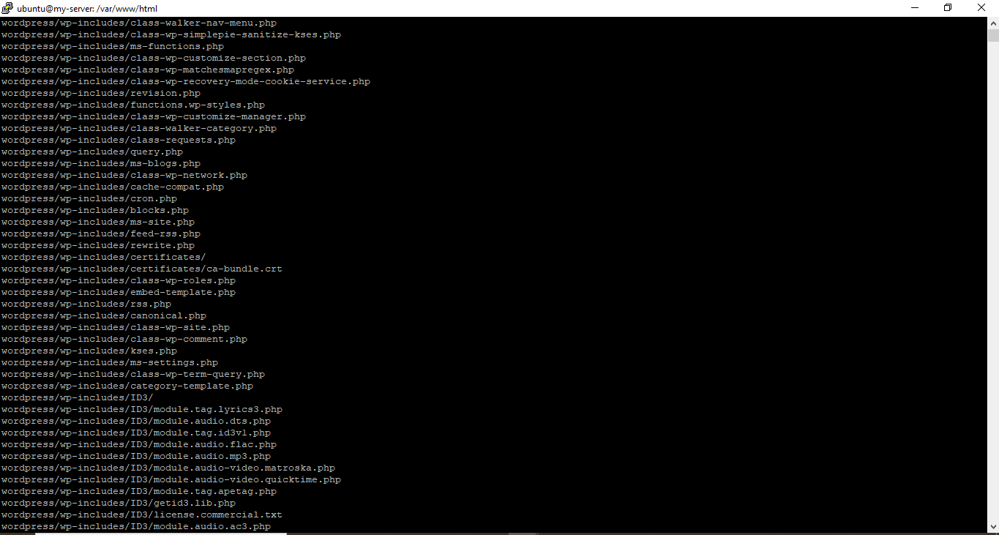
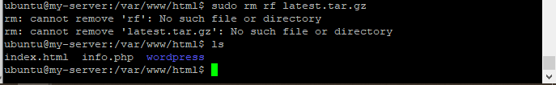
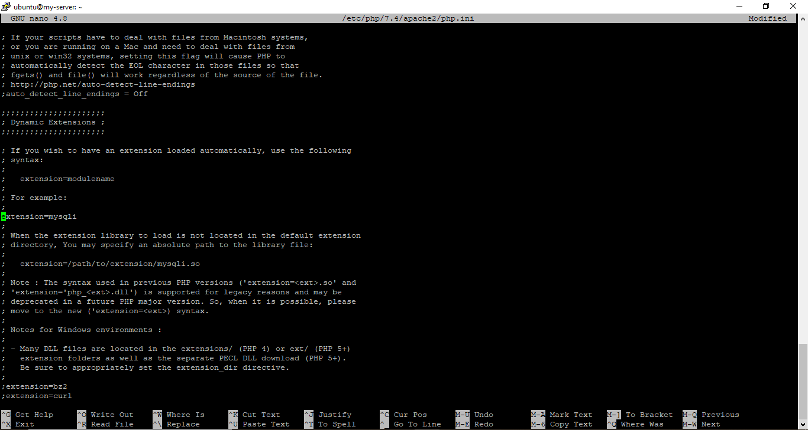

# 05 - PAAS -> KUIS1 - SETUP WORDPRESS VM + DB

## Hasil Praktikum

1. Setelah semua proses instalasi diatas selesai, sekarang kita coba untuk menginstal Wordpress pada PaaS. Dimana langkah pertama yang kita lakukan ialah membuat database baru, berikut untuk perintah yang harus dijalankan.  
   

2. Baru kemudian kita download Wordpress Pada Folder /var/www/html dengan perintah berikut.  
   

3. Jangan lupa setelah itu kita ekstrak Wordpress yang ada pada folder /var/www/html dengan perintah <b>tar zxvf latest.tar.gz</b>, maka proses yang berjalan akan seperti berikut.  
   

4. Selanjutnya, jika proses estrak file hasil download berhasil, kita bisa menghapus file hasil download dengan menggunakan perintah berikut.  
   

5. Selanjutnya, kita akan menginstall extension mysql pada php dan mengaktifkannya pada <b>php.ini</b>. Berikut adalah perintah untuk menginstall extenstion mysql pada php.   
   

6. Kemudian, kita coba akses file php.ini dan kita lakukan modifikasi seperti yang ada di dalam modul, yang mana fungsinya untuk mengaktifkan extension mysql pada php.  
   
   

7. Setelah semua proses diatas berhasil dilakukan, sekarang kita coba lakukan restart apache sekaligus setting ownership dan permissions dengan menggunakan perintah berikut.  
   

8. Setelah semua proses diatas berhasil dilakukan, sekarang kita coba lakukan restart apache sekaligus setting ownership dan permissions dengan menggunakan perintah berikut.  
   

9. Selanjutnya, kita akan melakukan proses Intalasi Wordpress melalui browser(http://168.138.51.31/wordpress). Berikut untuk step - stepnya.
#
1. Kita harus memilih terlebih dahulu bahasa untuk digunakan di dalam Dashboard Wordpress.   
   
2. Kemudian, kita coba melakukan pengisian data untuk membuat table.   
   
3. Setelah itu klik next, maka Wordpress siap diinstall.   
   
4. Kita lanjutkan dengan pengisian data Judul Site, Password dan Email.  
   
   
5. Berikut untuk tampilan Wordpress yang berhasil tersinstall.  
   

#

