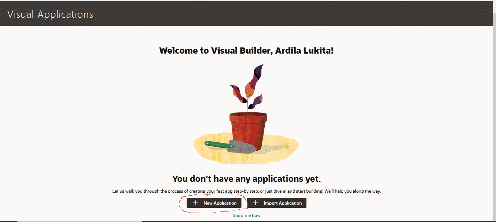
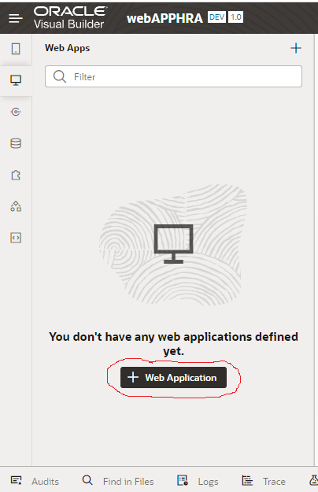
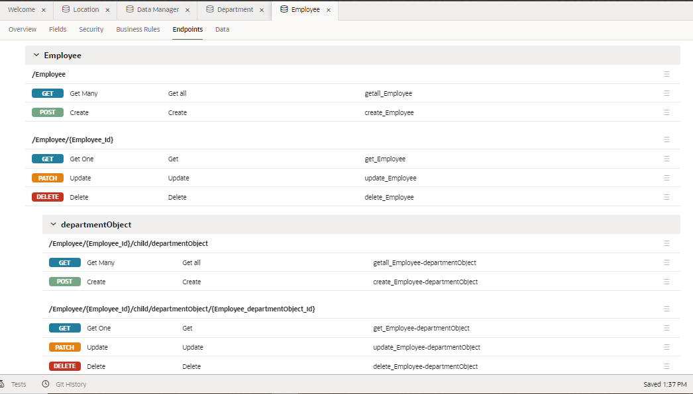
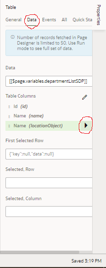
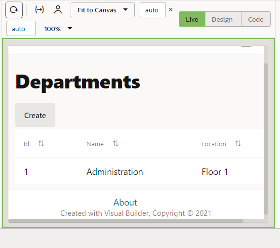
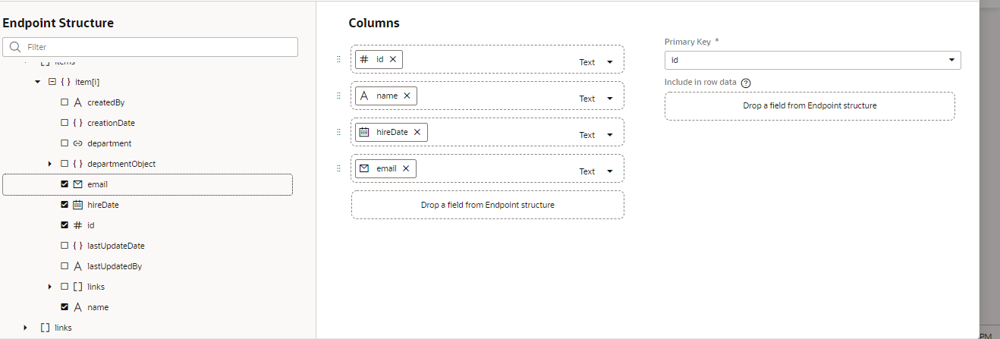
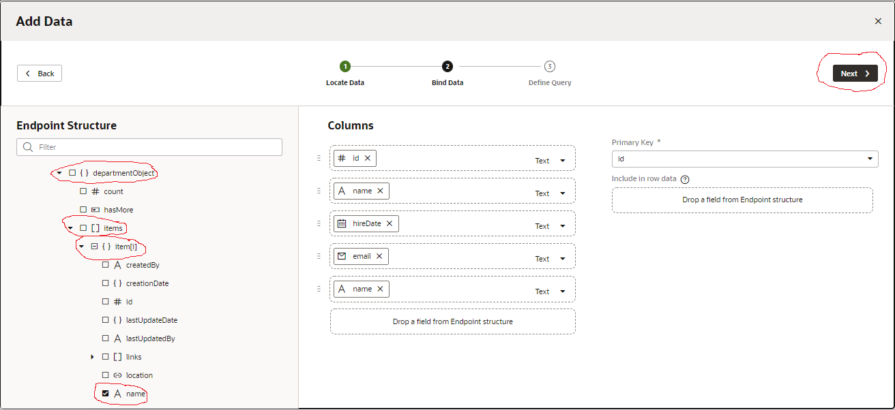

# 07 - SaaS

## Tujuan Pembelajaran

1. Mengetahui layanan Oracle Cloud Infrasturcture Software as a Service. 
2. Mampu mengguankan layanan software layanan oracle. 

## Hasil Praktikum

#

1. Membuat Aplikasi (Create Web Application) <b>Login OCI -> Pilih OCI Classic Service -> Create Instace.</b>  

2. Kemudian kita coba klik Create Instance.  

3. Selanjutnya, kita isi bagian nama instace, nama, deskripsi dari instance, Region dan juga tags-nya.  

4. Setelah kita klik create, maka hasil instance yang telah dibuat akan seperti berikut:  

5. Kita coba Lihat  pada  pojok  kiri, dimana akan terdapat  simbol  menu  (klik  simbol  tersebut  dan  akan  muncul  menu  berikut). Kemudian, kita pilih <b>Open Visual Builder Home Page.</b>  

6. Kemudian, kita tunggu beberapa saat, jika berhasil akan muncul halaman berikut. Klik <b>New Application.</b>  
 

7. Isi informasi tentang aplikasi yang akan dibuat :  
 

8. Jika kita berhasil membuat, maka akan muncul nama aplikasi yang akan kita buat seperti gambar dibawah ini. Pada  sisi  kiri  adalah  menu  dari  (kotak  berwarna  merah)  visual  builder  dari  aplikasi  yang  akan  kita 
buat.  
 

9. Disini kita coba pilih ikon web, maka akan muncul menu berikut :  
 

10. Pada  dialog  box  <b>Create  Application</b>,  isi  nama  web  dengan  nama  <b>hrwebapp</b>  dan  untuk 
novigation style biarkan <b>none</b>.  
 

11. Selanjutnya, kita coba <b>Expand  hrwebapp</b>, maka akan  melihat  struktur - struktur dari aplikasi web kurang  lebih seperti gambar dibawah ini:  
 

#

# Import Location Busines dari file 
### Pada tahap ini kita akan membuat object busines location dan melakukan import data. 

1. Kita klik <b>Busines Object</b> , pada <b>tab navigator</b>:  
 

2. Klik tombol <b>+ Busines Object</b>.  
 

3. Pada dialog box <b>Busines Object</b>, isi field label dengan <b>Location</b>, kemudian tekan tombol create 
(pada field name akan otomatis terisi).  
 

4. Klik <b>+ Field</b> untuk menambahkan <b>Busines Object</b>.  
 

5. Ketika pup-up box, dan kita isikan data - data berikut :
    • Label: Name 
    • Field Name: name (automatically populated) 
    • Type: String String (selected by default)  
 

6. Pada property instpector, centang Required di bawah label constrain.   
 

7. Kemudian, kita klik menu icon dan pilih Data Manager (Data Manager bisa kita gunakan untuk mengimpor data dari berbagai sumber)  
 

8. Pilih Impor From File.  
 

9. Di kotak dialog <b>Impor Data</b>, klik <b>kotak impor</b>, pilih <b>Location.csv</b>, dan klik Impor Ketika impor berhasil, klik Tutup.  
  
 

10. Kemudian, di panel <b>Bisnis Object</b>, klik <b>Location</b>, lalu klik <b>tab Data</b> untuk melihat Location.  

#

# Department Business Object

1.  Pada panel <b>Business Objects</b>, klik tanda <b>+</b>, lalu pilih <b>Business Object</b>.  

2.  Pada <b>new Business Object dialog Box</b>, Pada field label isi dengan <b>Department</b>.  
 

3.  Selanjutnya, kita klik <b>Fields</b> tab kemudian klik <b>+ Field</b>.  
 

4. Pada pop-up box, masukan: 
    • Label: <b>Name</b>
    • Field Name: name (automatically populated) 
    • Type: String String icon (selected by default) 
    • Click <b>Create Field</b>.  
  

5. Pada property instpector, centang <b>Required</b> di bawah label constrain.  
  

6. Klik <b>Fields tab</b> kemudian klik <b>+ Field</b> 
    - Label: Location 
    - Field Name: location (automatically populated) 
    - Type: Reference Reference icon 
    - Referenced Business Object: Location 
      (Reference field seperti foreign key pada database table) 
    - Display Field: Name (automatically populated)  
 
  

#

# Employee Business Object 
### Pada langkah ini, kita akan membuat objek bisnis terakhir yang kita butuhkan, objek Karyawan, yang berisi nama  karyawan  dan data  pengenal.  Dalam  hal  ini,  Karyawan memiliki  bidang  Referensi  yang merujuk ke Departemen. 

1.  Pada panel <b>Bisnis oject</b>, klik tanda <b>+</b>, lalu pilih <b>Bisnis Objek</b>.  
 

2. Pada <b>new Business Object</b> dialog Box, Pada field label isi dengan <b>Employee</b>.  
  

3. Klik <b>Fields tab</b> kemudian klik <b>+ Field</b>.  
   

4.  Pada pop-up box, masukan: 
        • Label: Name 
        • Field Name: name (automatically populated) 
        • Type: String String icon (selected by default)  
   

5.  Pada property instpector, centang <b>Required</b> di bawah label constrain.  

6. Pilih <b>+ Fields</b>, kemudian masukkan atau isi: 
    • Label: Department 
    • Field Name: department (automatically populated) 
    • Type: Reference Reference  
    • Referenced Business Object: Department 
    • Display Field: Name (automatically populated)
   Klik <b>Create Field</b>.   
 

7. Pilih <b>+ Fields</b>, kemudian masukkan atau isi: 
    • Label: Hire Date 
    • Field Name: hireDate (automatically populated) 
    • Type: Date Date  
   Klik <b>Create Field</b>.   
 

8. Pilih <b>+ Fields</b>, kemudian masukkan atau isi: 
    • Label: Email 
    • Field Name: email (automatically populated) 
    • Type: Email Email
   Klik <b>Create Field</b>, di editor properti, bagian Format kita atur ke Email.  
 
 

9. Klik tab Endpoints dan lihat API resource dan REST end point yang dibuat untuk Business Object Empoyee.  Karena Object  Employee  merujuk  ke  Department,  kita  dapat  melihat  end  point  untuk kedua  objek  terseut  jika  Anda memperluas  node  departmentObject.  Perluas  node  Resource  API untuk melihat URL untuk mengakses metadata dan data untuk objek bisnis, lalu perkecil lagi.  
 
  

10. Di panel <b>Objek Bisnis Navigator</b>, klik <b>tab Diagram</b>, lalu klik tombol <b>+ busines object diagram</b>.  
 
 

11. Pada <b>Create Business Object Diagram dialog box</b>, isi field Diagram name dengan <b>HRDiagram</b>.  

12. Kemudian, pada properti inspector, kita checklits semua pilihan yang ada, seperti berikut untuk detailnya.  

#

# main-start Page untuk Display Departments

1.  Pilih <b>Web Applications</b> pada <b>tab navigator</b>.  
 

2. Expand main nodes.  

3. Selanjutnya, kita perhatikan pada componen palette dan kita coba untuk menempatkan <b>Heading</b> komponen pada bagian common, kemudian drag (heading) ke halaman.  
 

4. Pada heading property inspector, isi text field dengan <b>Departments</b>.  
  

5. Pada components palette, scroll down sampai menemukan <b>collection</b>, pilih <b>table</b>, kemudian drop di bawah heading(departement).  
  

6. Klik <b>Add Data di Property Inspector</b> untuk membuka <b>Add Data Quick Stats</b>.  
  

7. Pada halaman <b>Quick Start</b>, pilih busines object Departemen, lalu klik next.  
  

8. Pada halaman <b>Bind Data</b>, di bawah item[i], centang id dan nama.  
   

9. Perluas  node  locationObject  dan  item  dan  pilih  name  untuk  mengaktifkan  location  name  agar muncul di tabel. Klik <b>next</b>.  
   

10. Pada halaman Query Page, klik <b>Finish</b>.  
   

11. Untuk membuat kolom nama lokasi deskriptif, klik <b>Data tab</b>. dibawah <b>Table</b> (side menu bar sebelah kanan), klik ikon Detail arrow disebelah Name (locationObject)  
   

12. Pada kolom, Header text field, ubah <b>Name</b> menjadi <b>Location</b>. Kemudian klik simbol berikut untuk kembali ke sub menu <b>Data tab</b>.  
     

#

# Page untuk Department Business Object

### Halaman create memungkinkan kita untuk mengisi tabel dengan data dengan membuat instance baru dari busines object. 

1.  Klik <b>Quick Start</b> (side menu sebelah kanan), kemudian klik <b>Add Create Page</b>.  
  

2. Kemudian pada halaman <b>End point</b>, pilih busines object <b>Department</b>, kemudian pilih <b>next</b>.  
   

3. Pada halaman detail page, dibawah <b>endpoint structure</b>, pilih dan centang <b>location</b>.  
  

4. Isi field <b>Button label</b> dengan <b>Create</b>. Kemudian klik tombol <b>Finish</b>.  
   

5. Setelah kita tekan tombol finish, akan muncul komponen tombol  Create  di atas tabel di halaman awal  utama. Klik tab  Web Application (side menu sebelah kiri) untuk melihat halaman main-create-department yang berada dalam satu list main-start.  
 

6. Klik <b>main-create-department</b> dan buka Page Designer. Pada halaman tersebut kita bisa melihat ada 2 filed sama seperti langkah ke-4. Selain itu terdapat 2 tomol Cancel dan Save.  
 

7. Kemudian, kit menuju pada halaman Quic Preview klik <b>Live</b>, pada mode ini kita bisa mencoba apakah form yang kita buat sudah berjalan atau tidak.  
 

8. Pada field Name ise dengan <b>Administration</b> dan untuk lokasi pilih <b>Floor 1</b>.  
  

9. Kemudian klik <b>Save</b>, maka akan muncul pesan dan <b>Oracle Visual Builder</b> akan mengarahkan kita ke halaman flow diagram dari halaman yang kita buat.  
  

10. Sekarang kita coba buka halaman <b>main-start</b>, bisa kita lihat data pada tabel telah ditambahkan.  
  

#

# Menambah Halaman Display Employees 

### Pada bagian ini, Kita akan membuat halaman untuk menampilkan Employee, prosesnya mirip dengan pada langkah sebelumnya (membuat halaman departement). 

1.  Pada main klik simbol + pada <b>main</b> node.  
  

2. Pada dialog box Creating Page, masukkan <b>employees</b> setelah prefix main-, kemudian klik <b>create</b>.  
  

3. Kemudian tambahkan <b>Heading</b> pada halaman <b>main-employess</b>, dengan cara melakukan drop komponen heading ke halaman main-employess.  
  

4. Ganti filed text pada side menu (sebelah kanan) properties <b>Heading</b> dengan <b>Employees</b>.  

5. Kemudian tambahkan komponen <b>Table</b> pada halaman main-employess.  
 

6.  Klik <b>Add Data</b>.  
  

7. Pada menu pop-up add data, pilih busines object <b>Employee</b>, kemudian pilih <b>next</b>.  
 

8. Untuk filed data pilih <b>id, name, hireDate, dan Email</b>.  
  

9. Expand <b>departmentObject -> item nodes</b>, pilih <b>name</b>, kemudian pilih <b>next</b>.  
  

10. Kita bisa melewat halaman <b>Define Quire</b>, pilih <b>Finish</b>.  
  

11. Kembali ke menu properties pilih tab <b>Data</b>, dibawah table column <b>name</b> (paling bawah) klik pada field columnt header text isi dengan <b>Department</b>.  
 
    

12. Klik simbol seperti berikut untuk kembali ke Data <b>tab</b>.  
   

#

# Halaman Create untuk Employee Busines Object 

1. <b>Quick Start</b>, klik <b>Add Create Page</b>.  
    

2. Kemudian, kita pilih end point <b>Employee</b>.  
    

3. Untuk filed pilih <b>hireDate, email, dan departement</b> (name otomatis dipilih karena required field).  
 

4. Pada field Button Lable isi dengan <b>Create</b>, klik <b>finish</b>.  
 

5. Klik live, kemudian masukan data name: Lasile Smith, Hire Date: (today), 
   -  email: lsmith@example.com  
   -  Departmet:  Administration.  
   Kemudian  pilih  Save. Setelah itu kita akan diarah ke halaman Page Flow. Ketika kita kembali ke halaman main-employess akan tampil data yang telah kita isikan (jika tidak tampil klik tombol reload page ).  
  

6. Kemudian klik <b>Save</b>, maka akan muncul pesan dan <b>Oracle Visual Builder</b> akan mengarahkan kita ke halaman flow diagram dari halaman yang kita buat.  
  

7. Maka, di bagian <b>main-employees</b> akan tampil data yang telah kita inputkan sebelumnya.  
  

8.  Klik <b>Code</b> untuk melihat kode HTML dari halaman main-employess.  
   

9. Klik <b>Design</b> untuk kembali  ke halaman main-employees, kemudian klik <b>Structure</b>.  
   

10.  Disini kita bisa klik <b>Structure</b> kembali untuk menutup structure view. 

#

# Mengganti Nama Halaman main-start

1.  Pada Side menu <b>(Web Apps)</b> klik kanan pada <b>main-start</b>, kemudian pilih <b>rename</b>.  
   

2. Pada pop-up menu, pada filed ide Ganti nama <b>start</b> dengan <b>departments</b>, sehingga akan menjadi 
seperti:  
 

3. Kemudian, kita coba double klik pada <b>main-departments</b>.

4. Selanjutnya, kita klik <b>Source View</b> expand <b>webApps, hrwebapp, flows, dan main nodes</b>. Kemudian klik <b>main-flow.json</b>.  

#

# Action Chain halaman Departments ke halaman Employess 

1. Tambahkan <b>Button</b> pada halaman <b>main-departments</b>, beri nama botton <b>Dispalay Employee</b>.  

2. klik <b>+ New </b> (side bar properties), pilih <b>Quick Start: ‘ojAction’</b>, setelah di klik sebuh action 
chain akan dibuat dengan nama <b>ButtonActionChain</b>, berisi <b>Start</b> action.  
 

3.  Drag  <b>Navigate</b>  action  dari  <b>Navigation</b>  section  yang  ada  di  Action  Palatte  ke  tanda  +  dibawah action start.  
  

4. Pada <b>Navigate</b> Property insptector, Pada filed Target pilih <b>main-employees</b>.  
 

5. Kita coba klik <b>Preview</b> yang ada di header untuk menguji halaman dan navigasi. Maka, secara otomatis aplikasi  akan  membuka browser  tab  yang  lain,  click  <b>Create</b>  dan  tambahkan  data  departemetn  (contoh:  IT  ->  Floor  2). Kemudian klik <b>Save</b>.  
  
 

6.  Klik  <b>Display  Employees  Page</b>,  kemudian  klik  <b>Create</b>.  Tambahkan  data  employee  sesuatikan dengan nama departemet yang baru dibuat.  
  

7. Untuk proses action chain halaman employees ke halaman departments sama dengan pada langkah sebelumnya, beri nama  tombol  <b>Display  Departments</b>.  Untuk Navigate  Page <b>Navigate  main-departments</b>.  
  

8. Kemudian, klik <b>main -> Page Flow</b>, maka akan muncul diagram kurang lebih seperti berikut:   

#

# Import Data ke Busines Object

1. Pada Navigator, Pilih tab <b>Busines Object</b> , kemudian klik <b>Object tab</b>.   

2. Klik  <b>Departement</b>  kemudian  klik  <b>Data  tab</b>,  kemudian  akan  tampil  jenis  object  yang  telah  kita 
buat tadi.   

3. Klik <b>Import from File</b>.   
 

4. Pada  dialog-box  import  data,  pilih  <b>Replace</b> untuk  <b>Row  Handling</b>  jika  belum  dipilih.  Kemudian 
klik upload box, browse, pilih file <b>Departement.csv</b> dan klik <b>Import</b>  
  
  

5. Ulangi langkah yang sama (langkah 1-4) untuk import data Employee menggunakan file <b>Employee.csv</b>.  
  
   

#

# Halaman Edit Department Busines Object (data manipulation) 

1. Pada  aplikasi  HR  Application,  tab  <b>Web  Application</b> pilih  halaman  <b>main-departments -> Page  Designer</b>. Klik <b>Reload Page</b> jika diperlukan, untuk menampilkan update halaman terbaru (setelah import data).  

2. Klik  komponen  table  yang  ada  di  halman  <b>main-departments</b>,  kemudian  pada  properties  (side menu sebelah kanan) pilih <b>Quick Start</b>, klik <b>Add Edit Page</b>.  
 

3. Untuk halaman <b>end point</b>, pilih business object <b>Department</b>, kilik <b>Next</b>.  
  

4. Untuk <b>update end point</b>, pilih businees object <b>Department</b>, kemudian klik <b>Next</b>.  
  

5. Pada  halaman  Page  Details,  pilih  location  dibawah  struktur  Endpoint  (<b>name</b>  otomatis  akan dipilih), klik <b>Finish</b>. Tombol <b>Edit Department</b> akan tampil pada halaman main-department, tetapi halaman tersebut masih belum aktif.  
 
  

#

# Halaman Detail untuk Department Busines Object

1. Pilih Quick Start menu, klik <b>Add Detail Page</b>.  
  
 
2. Pilih halaman end point business object <b>Department</b>.  
  

3.  Pada  Page  Detail,  pilih  name  dibawah  EndPoint  Structure,  expand  locationObject  dan  items (item[i])  pilih  name,  klik  Finish. Tombol  Department  Detail  akan  ditampilkan pada  toolbar yang ada pada halaman main-department, untuk saat ini tombol tersebut masih belum aktif.  
  
 
4.  Klik Live, pilih data (terserah), klik tombol  Departement Detail untuk membuka halaman main-department. 
 
5.  Klik Design untuk kembali ke mode Desain. 

6.  Klik main-department-detial, pilih Name (paling bawah), ganti label  menjadi Location <b>(Properties -> General -> Label Hit)</b>.  
  

#

# Halaman Delete untuk Department Busines Object

1. Kembali ke halaman <b>main-department</b>, klik <b>Quick Start</b> kemudian klik <b>Add Delete Action</b>.  
   

2. Pilih Endpoint busines object <b>Department</b>.  
  

3. Tombol  <b>Delete  Department/</b>  akan  ditampilkan  pada  toolbar,  kondisi  tombol  akan  berada  pada <b>inactive</b>.  
  

#

# Test Fungsi Halaman Department Busines Object 

1.  Lakukan test pada setiap tombol yang telah Anda buat dengan menggunakan mode <b>review</b>.  
2.  Cobalah menambahkan Data, Update, dan menghapus data.  
 
 
 

#

# Employee Business Object 

1. Tambahkan halaman edit, detail dan delete pada halaman busines object Employee.  
2. Preses pembuat halaman sama dengan langkah sebelumnya, Pilih Quick Start (Add Edit Page dan Delete Action Page.  
3. Untuk  page  edit pada  busines  object  employee  pilih  name  (otomatis  dipilih)  hireDate,  email, dan department.  

4. Set agar tampilan pada halaman Edit employe menjadi seperti ini (2 row)  
 
  

5. Untuk  field  detail  page  pilih  name,  hireDate,  email.  Expand  departmentObject -> items -> name. Klik Finish.  
 

6.  Ganti label name (yang ke dua/paling bawah) pada halaman Employee Detail menjadi Department (Properties-> General -> Label Hint).  

7. Tambahkan  halaman  Delete  Employee  dengan  menggunakan  objct  busines  Employee,  sehingga tampilan akhir dari main-employee menjadi seperti dibawah ini:  

#

# Test Fungsi Halaman Employee Busines Object 

1.  Lakukan test pada setiap tombol yang telah Anda buat dengan menggunakan mode review. 
2.  Cobalah menambahkan Data, Update, dan menghapus data.  
 
 
 
  

#
# Stage and Publish

1. Kembali ke halaman utama Visual Builder.  
2. Pada aplikasi yang telah dibuat klik Options , kemudian select Stage.  

3. Pada popup-box pilih Populate Stage with Development data kemudian klik Stage.  

4. Application stage berubah dari development ke stage.  

5. Klik Stage, pilih hrwebapp (nama apliaksi web yang kita buat). Setelah kita klik akan membuka tab  baru  pada  web  browser  yang  kita  gunakan.  Pada  halaman  yang  baru  dibukan  akan  ada  data yang kita tambahkan pada saat development.  
 
  

#

# Publish Application 

Setelah  kita  berhasil  menguji  aplikasi  pada  tahap  sebelum,  kita  dapat  mempublikasikannya  dan 
membuat aplikasi live. Aplikasi langsung dapat dilihat oleh pengguna dengan kredensial yang tepat. 

1. Klik ikon menu icon berikut dan select Publish.  
 

2. Pada pop-up box select Include data from Stage dan klik Publish.  
  

3. Klik OROCLE Visual Builder untuk kembali Visual Applications page.  
4. Klik Live dan pilih hrwebapp. Aplikasi akan membuka tab browser baru.  
  

Data akan secara otomatis terisi dengan data saat kita melakukan stage, tetapi jika ingin memulai aplikasi  dengan  database  yang  kosong  kita  bisa  memilih  Publish  application  with  a  clean database.  
   

5. Catat link dari aplikasi yang telah kita buat, dari link tersebut kita membagikannya ke Public User. 

