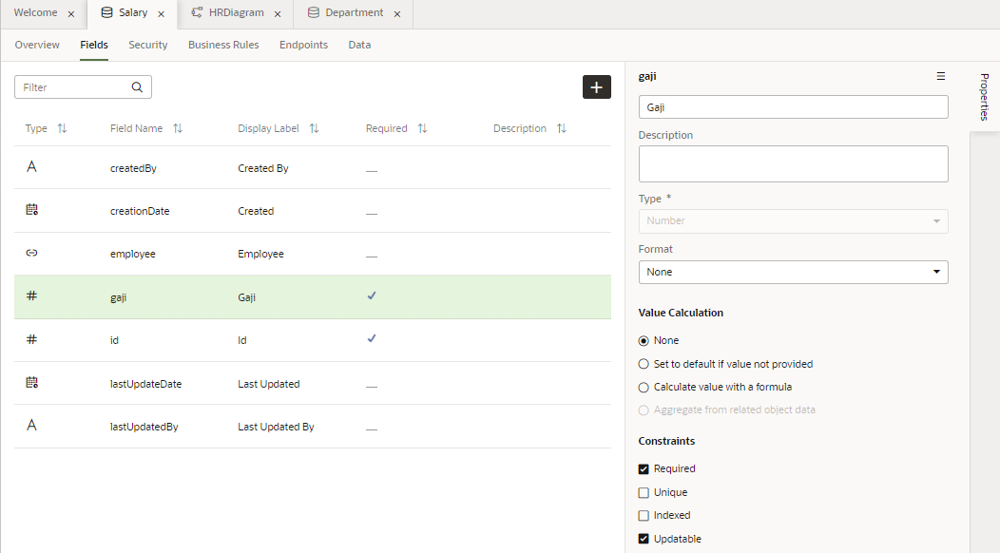
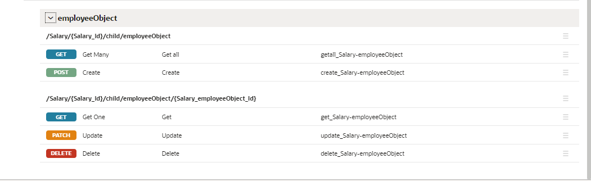
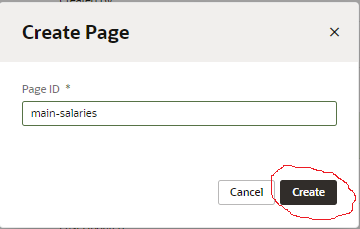
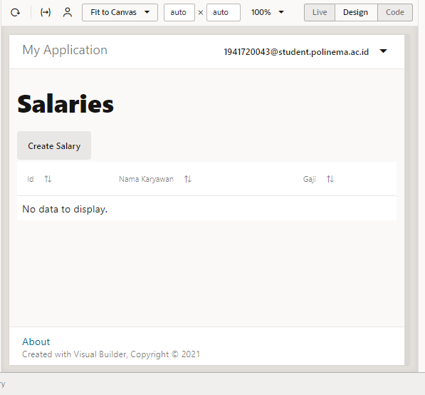
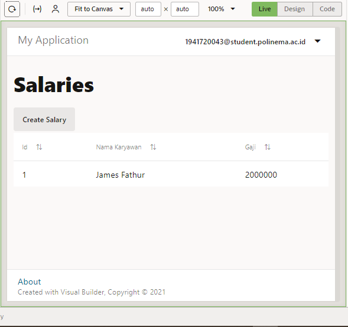
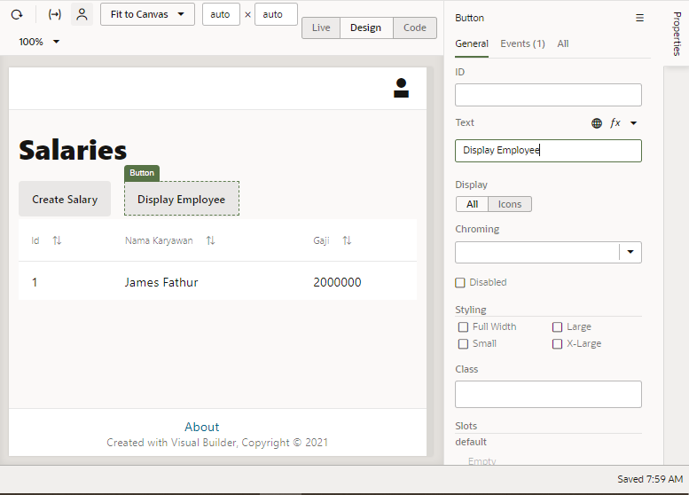

# 07 - SaaS

## Tujuan Pembelajaran

1. Mengetahui layanan Oracle Cloud Infrasturcture Software as a Service. 
2. Mampu mengguankan layanan software layanan oracle. 

## Tugas - Tambahkan busines oject Salary. 

1. Kita klik <b>Busines Object</b> , pada <b>tab navigator</b>.  
 

2. Kemudian,  pada new Business Object dialog Box, kita isi bagian field label dengan <b>Salary</b>.  
  
  

3. Selanjutnya, kita coba klik <b>ields</b> tab, kemudian klik <b>+ Field</b>.  
 

4. Pilih + Fields, kemudian kita masukkan atau isikan: 
    • Label: Gaji
    • Field Name: gaji (automatically populated) 
    • Type: Number Number  
  
 

5. Pilih + Fields, kemudian mauskan atau isi: 
    • Label: Employee 
    • Field Name: employee (automatically populated) 
    • Type: Reference Reference  
    • Referenced Business Object: Employee 
    • Display Field: Name (automatically populated)
Klik Create Field.   

6. Klik tab Endpoints dan lihat API resource dan REST end point yang dibuat untuk Business Object Empoyee.  Karena <b>Object  Salary</b>  merujuk  ke  <b>Employee</b>,  kita  dapat  melihat  end  point  untuk kedua  objek  tersebut  jika  kita  memperluas  node  <b>EmployeeObject</b>.  Perluas  node  Resource  API untuk melihat URL untuk mengakses metadata dan data untuk objek bisnis, lalu perkecil lagi.   
  

7. Lalu, di bagian <b>panel Objek Bisnis Navigator</b>, klik tab <b>Diagram</b>, lalu klik pilih <b>HRDiagram</b>. Kemudian, pada side kanan <b>Panel Diagram</b>, tepatnya di bagian bawah button search filter, kita checklist business object <b>Salary</b> dengan tujuan agar data dapat tampil pada diagram.   

#

# Main-Start Page Untuk Display Salary

1. Pilih <b>Web Applications</b> pada tab navigator. 

2. Expand main nodes.    

3.  Pada  dialog box Creating  Page, kita masukkan <b>salary</b> setelah prefix main-, kemudian klik <b>create</b>.   
  
 

4.  Kemudian. kita tambahkan Heading pada halaman <b>main-salaries</b>, dengan cara melakukan drop komponen heading ke halaman <b>main-employess</b>.   
 

5. Lalu, tambahkan komponen Table pada halaman <b>main-salaries</b>.   

6. Klik Add Data.   
 

7. Pada menu pop-up add data, pilih busines object <b>Salary</b>, kemudian pilih <b>next</b>.   
  

8. Untuk filed data pilih <b>id dan gaji</b>. Jangan lupa, kita perluas  node employeeObject dan item, lalu pilih  name  untuk mengaktifkan <b>employee name</b>, agar nantinya bisa tampil di dalam tabel. Setelah itu, kita Klik <b>next</b>.   
   

9. Kita bisa melewat halaman Define Quire, pilih <b>Finish</b>.   

10. Untuk membuat kolom nama employee deskriptif, klik <b>Data tab</b>. dibawah Table (side menu bar sebelah kanan), klik ikon <b>Detail arrow</b> disebelah Name (employeeObject).   

11. Pada kolom, Header text field, ubah <b>Name</b> menjadi <b>Nama Karyawan</b>. Kemudian, klik untuk kembali ke sub menu <b>Data tab</b>.   
  

#

# Halaman Create untuk Salary Busines Object

Halaman  create  memungkinkan  kita  untuk  mengisi  tabel  dengan  data  dengan  membuat  instance baru dari busines object. 
1.  Klik ta Quick Start (side menu sebelah kanan), kemudian klik Add Create Page.   
  

2.  Kemudian pada halaman End point, pilih busines object Department, kemudian pilih next.   
  

3.  Pada halaman detail page, dibawah endpoint structure, pilih dan centang employee.   
  

4.  Isi field Button label dengan <b>Create Salary</b>. Kemudian klik tombol Finish. Setelah kita tekan tombol finish,maka, akan muncul komponen tombol  Create  di atas tabel halaman utama. Kurang lebih tampilannya akan seperti berikut.    
  

5. Klik  tab  <b>Web  Application</b>  (side  menu  sebelah  kiri)  untuk  melihat  halaman  <b>main-create-salary</b> yang berada dalam satu list main-departments, dkk.   

6. Kita coba klik  main-create-salary dan buka  Page  Designer.  Pada  halaman  tersebut  kita  bisa  melihat 
ada 2 filed, yaitu <b>Gaji dan Nama Karyawan</b>. Selain itu terdapat 2 tomol Cancel dan Save.   
 

7. Pada  halaman  <b>Quick  Preview  klik  Live</b>, dengan mode  ini  kita  bisa  mencoba  apakah  form  yang  kita buat sudah berjalan atau tidak. Untuk field Gaji kita isi <b>2000000</b> dan untuk Nama Karyawan kita pilih <b>James Fathur</b>.   
  
  
 

8. Klik Code untuk melihat kode HTML dari halaman <b>main-salaries</b>.  

9. Klik <b>Design</b> untuk kembali ke halaman <b>main-salaries</b>, kemudian klik <b>Structure</b>.  

10. Klik <b>Structure</b> lagi untuk menutup structure view.

#

# Action Chain halaman Salaries ke halaman Employees

1. Kita coba tambahkan Button pada halaman main-salaries, disini kita beri nama botton <b>Display Employee</b>.  

2. Kemudian, klik <b>+ New Event</b> (side bar properties), pilih <b>Quick Start: ‘ojAction’</b>, setelah di klik sebuah action chain akan dibuat dengan nama <b>ButtonActionChain</b>, berisi <b>Start</b> action.  
 

3. Drag  <b>Navigate</b>  action  dari  <b>Navigation</b>  section  yang  ada  di  Action  Palatte  ke  tanda  +  dibawah action start. Lalu, pada Navigate Property insptector, bagian filed Target, kita pilih <b>main-employees</b>.  
 

4. Lalu, kita coba tambahkan juga Button pada halaman main-employees, disini kita beri nama botton <b>Display Salary</b>.  

5. Kemudian, klik <b>+ New Event</b> (side bar properties), pilih <b>Quick Start: ‘ojAction’</b>, setelah di klik sebuah action chain akan dibuat dengan nama <b>ButtonActionChain</b>, berisi <b>Start</b> action.  
 

6. Drag  <b>Navigate</b>  action  dari  <b>Navigation</b>  section  yang  ada  di  Action  Palatte  ke  tanda  +  dibawah action start. Lalu, pada Navigate Property insptector, bagian filed Target, kita pilih <b>main-salaries</b>.  
 

7. Klik <b>Preview</b>. di header untuk menguji halaman dan navigasi. Aplikasi akan membuka browser  tab  yang lain, click <b>Crate</b> dan tambahkan data employee. Kemudian klik Save.  
 
 
  

#

# Import Data ke Busines Object 

1. Pada Navigator, Pilih tab Busines Object , kemudian klik Object tab.  

2. Klik  Salary kemudian klik  Data  tab,  kemudian  akan  tampil  jenis  object  yang  telah  kita 
buat tadi.  

3. Klik Import from File.  
4.  Pada  dialog-box  import  data,  pilih  Replace  untuk  Row  Handling  jika belum  dipilih.  Kemudian, klik upload box, browse, pilih file Salary.csv dan klik Import.  
 

#

# Halaman Edit Salary Busines Object (data manipulation)

1. Pada  aplikasi HR Application, tab Web Application pilih halaman <b>main-salaries -> Page Designer</b>.  Klik <b>Reload Page</b> jika  diperlukan, untuk menampilkan update halaman terbaru (setelah import data).  
 

2. Klik  komponen  table  yang  ada  di  halaman  <b>main-salaries</b>,  kemudian  pada  properties  (side 
menu sebelah kanan) pilih <b>Quick Start</b>, klik <b>Add Edit Page</b>.  

3.  Untuk halaman end point, pilih business object <b>Salary</b>, kilik <b>Next</b>.  

4.  Untuk update end point, pilih businees object <b>Salary</b>, kemudian klik <b>Next</b>.  

5.  Pada  halaman  Page  Details,  pilih  employee  dibawah  struktur  Endpoint  (name  otomatis  akan 
dipilih), klik Finish. Tombol Edit Salary akan tampil pada halaman <b>main-salaries</b>, tetapi halaman tersebut masih belum aktif.  

#

# Halaman Detail untuk Department Busines Object 

1.  Pilih Quick Start menu, klik <b>Add Detail Page</b>.  

2.  Pilih halaman end point business object  

3.  Pada  Page  Detail,  pilih  name  dibawah  EndPoint  Structure,  expand  locationObject  dan  items 
(item[i])  pilih  name,  klik  Finish.  Tombol  Salary  Detail  akan  ditampilkan pada  toolbar 
yang ada pada halaman main-salaries, untuk saat ini tombol tersebut masih belum aktif.  
 

4.  Ganti label name (yang ke dua/paling bawah) pada halaman Salary Detail menjadi Nama Karyawan(Properties-> General -> Label Hint). untuk kembali ke mode Desain.   

#

# Halaman Delete untuk Salary Busines Object 
1.  Kembali ke halaman main-salaries, klik Quick Start kemudian klik <b>Add Delete Action</b>.  

2.  Pilih Endpoint busines object Salary.  

3.  Tombol  Delete  Department  akan  ditampilkan  pada  toolbar,  kondisi  tombol  akan  berada  pada 
inactive. 

#

# Test Fungsi Halaman Salary Busines Object 
1.  Kita lakukan test pada setiap tombol yang telah kita buat dengan menggunakan mode <b>preview</b>.  
2.  Kita coba juga untuk menambahkan Data, Update, dan menghapus data. 
    a) Create Data  
       
       

    b) Detail Data  
        

    c) Update / Edit Data  
       
        

    d) Delete Data  
      

#

# Stage and Publish 
# Stage 
1.  Kembali ke halaman utama Visual Builder. 
2.  Pada aplikasi yang telah dibuat klik Options , kemudian select Stage.  
3.  Pada popup-box pilih Populate Stage with Development data kemudian klik Stage.  
 

4. Application stage berubah dari <b>development</b> ke <b>stage</b>.  
 

#

# Publish Application 
Setelah  kita  berhasil  menguji  aplikasi  pada  tahab  sebelum,  kita  dapat  mempublikasikannya  dan 
membuat aplikasi live. Aplikasi langsung dapat dilihat oleh pengguna dengan kredensial yang tepat. 

1.  Klik ikon <b>menu</b>  dan select <b>Publish</b>. 
2.  Pada pop-up box select <b>Include data from Stage</b> dan klik <b>Publish</b>.  
 

3.  Klik <b>OROCLE Visual Builder</b> untuk kembali <b>Visual Applications page</b>.  
4.  Klik <b>Live dan pilih <b>hrwebapp</b>. Aplikasi akan membuka tab browser baru.  
 

5. Data akan secara otomatis terisi dengan data saat kita melakukan stage, tetapi jika ingin memulai aplikasi  dengan  database  yang  kosong  kita  bisa  memilih  Publish  application  with  a  clean database.  
   

6. Catat link dari aplikasi yang telah kita buat, dari link tersebut kita membagikannya ke Public User. 
      