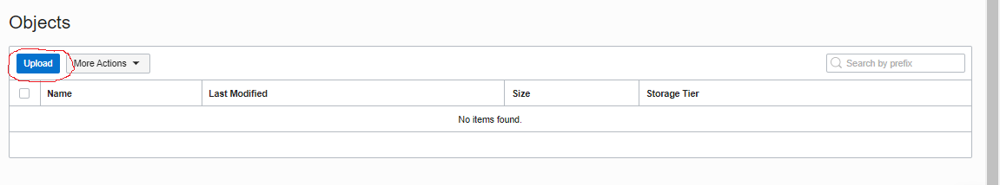

# 08 - Object Storage

## Tujuan Pembelajaran

1. Mengetahui cara membuat sataic website kemudian menghostinya ke Oracle Object 
Storage.

## Hasil Praktikum

#

1. Membuat bucket untuk website. Sign-in ke OCI kemudian pilih Object Storage.  

2. Create Bucket → Pilih standar bucket. 
Untuk free tier mendapatkan gratis 10 GB Object Storage dan 10 GB archive storage (jika penggunaan  lebih  dari  20  GB  dan  tidak  melakukan  upgrade  dari  free  trial  maka  otomatis  data  akan dihapus).  

<b>Noted : </b>  
(Bucket Name → bucket_tugas8)  

3. Disini terlihat bahwa bucket berhasil ter-create.  

4. Selanjutnya, kita buka bucket dengan melakukan klik pada nama bucket kemudian pilih <b>Edit Visibility</b>.Pilih Visibility menjadi <b>Public</b>. Tekan <b>Save Changes</b> untuk menyimpan perubahan.  
 

5. Kemudian, Uploading  web  page. Pada bagian bawah dari Bucket Information terdapat box Object(upload semua file yang ada pada folder <b>colorFliper</b>  
 
 

6. Setelah upload index.html file → Klik titik 3 pada sisi kiri file <b>index.html</b>.  
 

7. Kemudian, kita pilih <b>View Object Detail</b> (Panel detail akan menunjukkan detail URL objek)  

8. Kemudian pilih URL Path (URI) untuk membuka file.  

9. Maka, jika file yang di upload berhasil tampilan pada halaman akan seperti pada gambar di bawah ini:   
 

