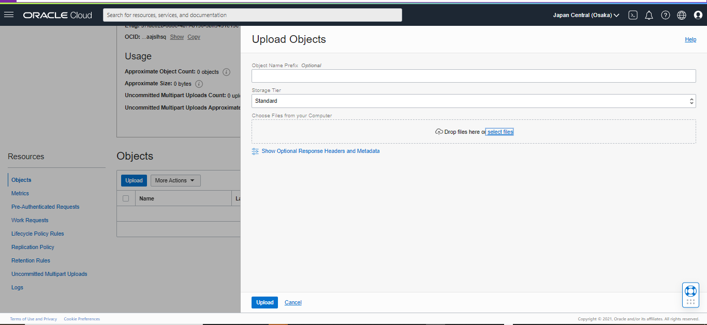

# UTS CLOUD COMPUTING

### Berikut adalah laporan terkait UTS Cloud Computing, Memanfaatkan Object Storage Sebagai Media Penyimpanan Assets Berdasarkan Aplikasi Wordpress.
#
## Hasil 

#

Berikut adalah langkah pengerjaan soal UTS Cloud Computing :

1. Hal pertama yang akan kita lakukan ialah, login terlebih dahulu ke dalam wordpress admin, dengan akun yang telah didaftarkan sebelumnya.  
 

2. Kemudian, setelah berhasil masuk ke halaman utama wordpress. Disini kita bisa klik menu <b>Themes atau Tampilan</b> untuk menambahkan themes baru. Untuk pembuatan themes ini sendiri kita kustomisasi sendiri dengan cara klik <b>customize atau sesuaikan</b>.  
 

3. Setelah kita klik <b>customize atau sesuaikan</b>, maka wordpress akan menampilkan halaman seperti berikut.  
 

4. Di halaman tersebut, kita bisa edit elemen - elemen yang ada. Berikut contoh hasilnya.  
 

5. Selanjutnya, kita coba tambahkan post baru dengan klik button berikut.  
 
Maka, halaman website akan tampil seperti berikut.br> 
 

6. Kita bisa mulai membuat bucket baru di dalam object storage oracle cloud yang nantinya akan berfungsi untuk menampung file object website.  
 

7. Selanjutnya, disini kita coba buka bucket dengan melakukan klik pada nama bucket kemudian pilih Edit Visibility.Untuk Visibility-nya akan kita ubah menjadi <b>Public</b>.  
 

Lalu, setelah proses perubahan dilakukan, jangan lupa kita klik <b>Save Changes </b>, agar perubahan yang kita lakukan tersimpan.

8. Lalu kita upload beberapa file yang membangun website ke dalam object storage.  
 

9. Berikut beberapa file object yang berhasil terupload.  
 

10. Setelah semua file berhasil teruplaod, sekarang kita kembali ke halaman admin wordpress, tepatnya di halaman post yang baru kita buat tadi, kita coba tambahkan gambar yang diambil dari object storage.  
  

<b>Noted : </b> 
Untuk menambahkan gambar kita pilih block image, lalu saat proses penginputan gambar ke halaman kita klik button <b>Insert from URL</b>. 

11. Kemudian, kita coba masukkan link direktori gambar yang ingin kita upload dan pastikan gambar tersebut sudah terupload di dalam object storage.  
 

12. Jika link sudah berhasil ditambahkan, maka gambar secara otomatis akan tampil di halaman wordpress.  
 

13. Selanjutnya, kita tambahkan link project website yang akan kita gunakan ke dalam postingan wordpress yang kita buat sebelumnya. Hal pertama yang kita lakukan pada tahapan ini ialah, menyalin link website yang ada di dalam storage.  
 

14. Lalu, kita coba tambahkan block paragraf baru di postingan wordpress sekaligus mengedit html dengan tujuan agar link yang kita masukkan dapat di akses.  
 

15. Berikut adalah cara untuk menginputkan link website ke dalam postingan wordpress.  
 

16. Maka hasilnya akan seperti berikut.  
 

17. Jika di klik, maka browser akan mengarahkan pada project website yang kita gunakan.  
 
 
 