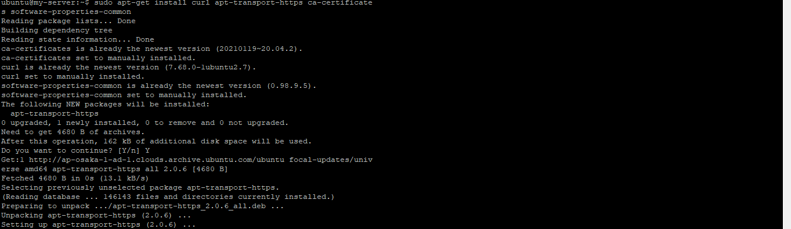
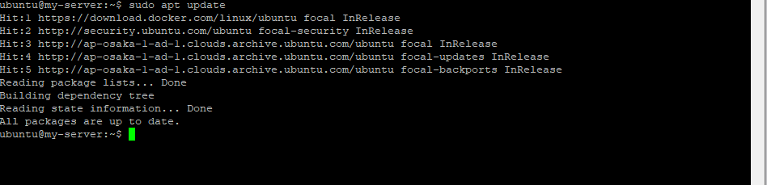

# 10 - Docker

## Tujuan Pembelajaran

1. Mengetahui cara instalasi docker di oracle cloud.
2. Mengetahui cara membuat container.
3. Mengetahui cara membuat akun docker hub.
4. Mengetahui cara build image.

## Hasil Praktikum

#
## 1. Install Docker 
# 

1. Silakan masuk ke virtual mesin Anda kemudian jalankan perintah di bawah ini.  
 

2. Install paket yang dibutuhkan sebelum melakukan installasi docker, jalankan perintah 
di bawah ini.  
 

3. Langkah  selanjutnya  yaitu  menambahkan  repository  docker,  dengan  beberapa  baris 
perintah di bawah ini.  
 
  
  
  
Disini, jika kita lihat output dari perintah terakhir menandakan bahwa docker belum terinstall dan sudah ada di repository untuk siap dilakukan installasi.

4. Silakan lakukan installasi menggunakan perintah berikut ini.  
 
Ketika progress installasi sudah selesai, kemudian cek apakah docker daemon sudah 
jalan menggunakan perintah systemctl. 
Jika menampilkan status active (running), berarti docker daemon sudah berjalan. Untuk 
lebih jelasnya perhatikan output di bawah ini.   
 

5. Untuk memastikan kembali, kita butuh menggunakan image test apakah docker benar-
benar berjalan sebagaimana semestinya. Gunakan perintah di bawah ini.  
  

6. ika kita perhatikan perintah-perintah di atas, untuk menjalankan docker harus menggunakan 
sudo,  sedangkan  terkadang  semua  pengguna  memiliki  image  masing-masing.  Untuk 
menjalankan perintah docker tanpa menggunakan sudo, berikut ini perintahnya.  
 

7. Agar  memberikan  perubahan,  logout  terlebih  dahulu  kemudian  login  kembali. Jalankan perintah docker tanpa menggunakan sudo seperti berikut.  
 

#

## 2. Membuat Container

1. Ketika kita mengembangkan aplikasi web tentunya membutuhkan sebuah web server, hal yang 
sering dilakukan dengan melakukan installasi paket tersebut diikuti dengan Langkah-langkah 
yang lain. Dengan docker, kita cukup satu baris perintah apache sudah bisa berjalan. Berikut 
ini perintahnya.  
 

2. Perintah  di  atas  digunakan  untuk  membuat  container  dengan  nama  contoh-apache  dengan 
mengexpose port 8080 dari port defaultnya 80, sedangkan image yang digunakan adalah httpd 
yang  merupakan  layanan  web  server  apache.  Parameter  -d  digunakan  untuk  menjalankan 
container secara background. Silakan cek menggunakan telnet seharusnya sudah bisa terhubung seperti pada gambar berikut.  
 

3. Agar port 8080 dapat diakses dari luar, tentunya Anda harus mengkonfigurasi terlebih dahulu 
firewall di Cloud Oracle-nya.

#

## 3. Membuat Akun Docker Hub

1. Silakan menuju halaman https://hub.docker.com/signup, akan memuat halaman berikut.  
 

2. Isikan  data-data  yang  dibutuhkan  seperti  docker  id,  email,  dan  password.  Jika  telah 
berhasil melakukan halaman pendaftaraan. Kita bisa login, kemudian bisa melihat repository yang telah Anda buat sebelumnya, jika telah 
membuat karena belum pernah membuat sebelumnya, maka repository masih dalam keadaan kosong.  
 
 

#

## 4. Membuat Akun Docker Hub

1. Clone project yang terdapat di https://gitlab.com/0d3ng/cloud-docker-java-sample.git.  
  

2. masuk ke dalam direktori tersebut dan jalankan perintah build seperti berikut.  
 

3. Jika  sudah  kita jalankan  container menggunakan image yang telah kita buat dengan perintah berikut.  
 
Namun, disini terlihat jika proses menjalankan container dengan menggunakan image yang telah kita buat sebelumnya gagal. Hal ini dikarenakan, sistem tidak berhasil menemukan main class Aritmatika.

4. Sekarang, kita lanjutkan untuk meng-upload ke docker hub kita, sebelumnya kita harus login terlebih dahulu dengan menggunakan perintah di bawah ini.  
 

5. Selanjutnya kita upload image yang telah kita buat menggunakan perintah di bawah ini.  
 

6. Sekarang kita coba cek docker hub, maka file hasil upload akan tampil.  
 

