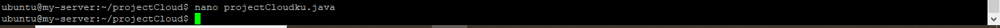

# 10 - Docker

## Tujuan Pembelajaran

1. Mengetahui cara instalasi docker di oracle cloud.
2. Mengetahui cara membuat container.
3. Mengetahui cara membuat akun docker hub.
4. Mengetahui cara build image.

## Hasil Praktikum

#
## 1. Install Docker 
# 

1. Kita buat direktori baru terlebih dahulu dengan nama projectCloud.  
 

2. Selanjutnya, kita buat kelas java dengan terlebih dahulu masuk ke dalam direktori yang telah kita buat sebelumnya.  
 
Kemudian, untuk mengisikan kode program ke dalam file project-cloud.java kita gunakan perintah berikut.  
 

3. Berikut untuk isi / script yang ada di dalam project-cloud.java.  
 

4. Lalu, kita buat Dockerfile di dalam direktori yang sama, yaitu <b>project-cloud</b>.  
 
Untuk script yang kita bisa tuliskan di dalam Dockerfile ialah sebagai berikut.  
 

5. Selanjutnya, kita coba untuk build Dockerfile yang telah kita buat menjadi sebuah images. Berikut perintah yang harus kita jalankan.  
 

6. Jika proses build sudah berhasil dilakukan, sekarang kita bisa cek daftar image yang berhasil tersimpan di dalam server oracle dengan menjalankan perintah berikut, disini kita menastikan juga bahwa docker image yang baru kita build berhasil tersimpan.  
 

7. Terlihat bahwa deploy aplikasi java ke Docker berhasil dilakukan. 
  
 
Sekarang kita bisa upload image yang telah kita buat ke dalam Docker. Disini terlebih dahulu kita login dengan cara menjalankan perintah berikut.  

 

8.  Selanjutnya kita upload image yang telah kita buat menggunakan perintah di bawah ini.  
 

9. Berikut tampilan yang menunjukkan bahwa image yang kita buat berhasil terupload di dalam repository Docker.  
 