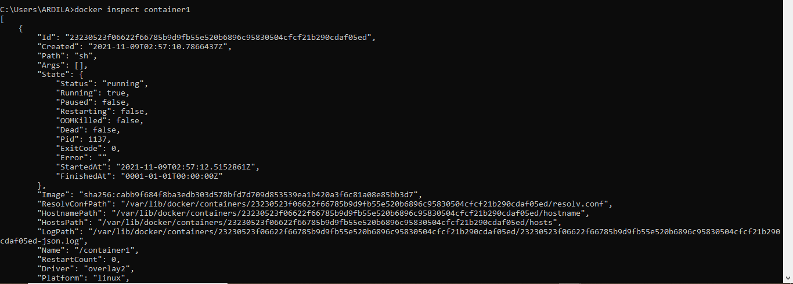
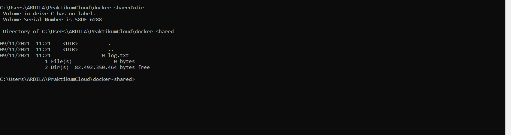
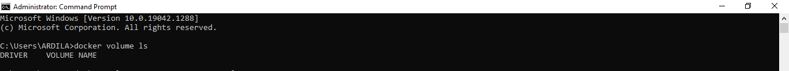
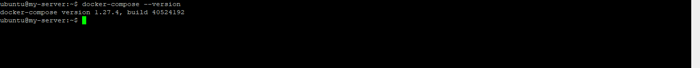

# 11 - Docker2

## Tujuan Pembelajaran

1. Mengetahui cara membuat dan memeriksa docker network.
2. Mengetahui cara menghubungkan container ke network.
3. Mengetahui cara membuka port container.
4. Mengetahui cara membuat volume.
5. Mengetahui cara menghapus volume.
6. Mengetahui tentang docker compose.

## Hasil Praktikum

#
## 1. Docker Network
### 1.1	Membuat dan Memeriksa Docker Network 

#

1. Pertama ketik perintah di bawah ini untuk mengetahui network yang tersedia pada docker host kita.  
 

2. Selanjutnya untuk mengetahui perintah-perintah dasar yang bisa digunakan untuk docker network.  
 

3. Untuk membuat network bisa menggunakan perintah create seperti pada gambar di bawah ini.  
 

4. Selanjutnya cek network yang sudah dibuat menggunkan perintah ls, seharusnya akan menambahkan network. Hasilnya adalah sebagai berikut.  
 

5. Terakhir, ketika ingin mengetahui informasi detail dari network yang telah kita buat bisa menggunakan perintah inspect.  
 

<b>Noted:</b> Network yang telah kita buat ini selanjutnya bisa kita gunakan untuk menghubungkan container satu dengan yang lain.

# 

### 1.2	Menghubungkan Container ke Network

#

1. Buat terlebih dahulu contoh container, misalkan kita akan membuat container linux yaitu busybox.  
 

2. Buat container yang kedua menggunakan image linux alphine, buka windows yang baru agar container1 tetap berjalan.  
 

<b>Noted:</b> Jangan lupa mengubah nama container dari yang sebelumnya.

3. Kemudian cek masing-masing container tersebut menggunakan perintah ps untuk mengetahui status container yang sedang jalan. Buka windows baru, jalankan perintah berikut.  
 

4. Kemudian jalankan inspect untuk mengetahui informasi detail dari masing-masing container.  
Container 1
 
 
  

Container 2
 
 
 

5. ntuk membuktikan silakan ping dari container1 ke container2, seharusnya akan reply.  
 

# 

### 1.3	Membuka Port Container

#

1. isalkan kita ingin membuat image dari apache, layanan httpd. Bisa dilakukan dengan perintah di bawah ini.  
 

2. Silakan cek menggunakan telnet terhadap port yang di-expose atau dengan mengetik pada browser seperti ditunjukkan di bawah ini.  
 

3. Kemudian untuk mengetahui port yang dilakukan expose pada container, bisa menggunakan perintah di bawah ini.  
 

<b>Noted:</b> Setelah mengetahui cara untuk melakukan expose dan mapping port, dapat diterapkan ketika Anda membuat container dan container tersebut bisa menerima request dari luar.

#
## 2. Docker Volume
### 2.1. Membuat Volume

#

1. Buat terlebih dahulu folder di host(laptop/computer/vps), misalkan buat folder docker-shared.  
 

2. Cek di folder local Anda, bisa menggunakan perintah ls atau dir. Dapat juga dilihat menggunakan windows explorer.  
 
  

<b>Noted:</b> etelah kita melakukan mapping volume dari container ke local direktori, kemudian kita akan membuat volume pada docker. 

1. Perintah pertama yang bisa dijalankan adalah sebagai berikut, mengecek volume yang telah ada sebelumnya.  
  
Disini terlihat masih kosong karena belum ada volume yang terbuat sebelumnya.

2. ntuk membuat volume baru, bisa menggunakanperintah di bawah ini.  
  

3. Disini terlihat bahwa volume yang baru kita buat berhasil tersimpan.  
  

4. Jalankan container dengan menyertakan volume yang telah kita sebelumnya dan buat file log.txt, jangan lupa masuk ke direktori volume terlebih dahlulu.  
  

5. uat container yang lain, dengan mengulangi langkah yang sama sebelumnya. Ketik perintah ls untuk mengetahui isi folder volume.  
  

#

### 2.1. Membuat Volume

#

1. Untuk menghapus volume yang telah kita buat sebelumnya dapat dilakukan dengan cara di bawah ini.  
  

<b>Noted:</b> Sebelum menghapus volume, pastikan terlebih dahulu volume tersebut tidak digunakan pada container.

#
## 3. Docker Compose

#

1. Silakan masuk ke oracle cloud dan ke VM Anda, kemudian install docker compose dengan perintah sudo curl -L "https://github.com/docker/compose/releases/download/1.27.4/docker-compose-$(uname -s)-$(uname -m)" -o /usr/local/bin/docker-compose.  
  

2. Ubah docker compose menjadi executable menggunakan command berikut.  
 

3. Cek versi docker compose untuk memastikan proses installasi berhasil dilakukan dengan perintah.  
 

4. Clone repo yang telah disediakan menggunakan git atau download secara manual.  
 

5. Masuk ke direktori tersebut dan ganti branch menjadi cloud-docker dengan perintah seperti berikut ini.  
 

6. Build image tersebut menggunakan perintah build pada docker.  
 

7. Selanjutnya buat folder data di bawah /opt agar data mysql tidak hilang ketika container dihapus.  
 

8. Jalankan docker compose menggunakan perintah berikut ini.  
 