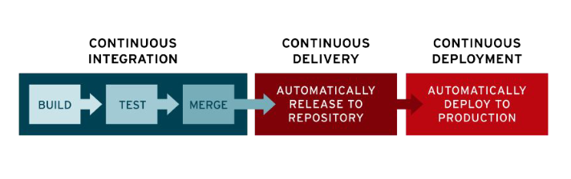
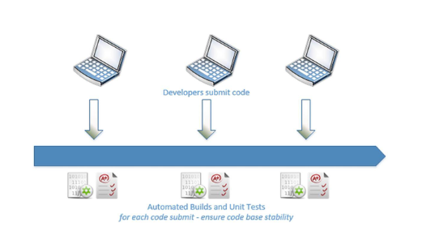
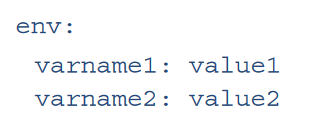

# Rangkuman 12 (CI/CD)

## Tujuan Pembelajaran
1. Student can understand about CI/CD
2. Student can create pipeline
3. Student  can  understand  about  variables, secrets and token.

### A. Introduction to CI/CD 
1. CI/CD adalah metode untuk sering mengirimkan aplikasi ke pelanggan dengan memperkenalkan otomatisasi ke dalam tahapan aplikasi perkembangan.
2. "CI" dalam CI/CD selalu mengacu pada integrasi berkelanjutan,yang merupakan proses otomatisasi untuk pengembang. 
3. "CD" dalam CI/CD mengacu pada pengiriman berkelanjutan dan/atau penyebaran berkelanjutan, yang merupakan konsep terkait yang terkadang digunakan secara bergantian.

### B. CI/CD Illustration

  
 

### C. CI/CD Overview

1. Dalam pengembangan perangkat lunak, beberapa anggota tim pengembang ikut berkontribusi dalam membuat perangkat lunak, sehingga ketika banyak orang berkontribusi pada sebuah kode dasar, penting untuk menjaga integritasnya dan memastikan bahwa setiap anggota tim dapat mengambil versi terbaru.
2. Ada dua aspek penting harus dipertahankan untuk menjamin stabilitas basis kode :  
a. Aspek pertama, adalah memastikan bahwa
kode dikompilasi tanpa kesalahan. 
b. Aspek kedua, adalah untuk memastikan bahwa semua pengujian unit yang memvalidasi perilaku kode lulus. 

### D. CI/CD

  
 

### D. Introduction to GitHub Actions
1. Action, bagian terkecil dari alur kerja adalah tindakan, yang dapat diidentifikasi sebagai tugas individu. 
2. Artifacts, File yang dihasilkan saat kita berhasil membuat perangkat lunak proyek atau uji proyek perangkat lunak. 
3. Event, Suatu peristiwa memicu alur kerja di GitHub Actions. 

### E. GitHub Actions
1. GitHub-Hosted Runners, mesin yang mirip dengan agen yang dihosting di Azure Pipeline DevOps. Mereka didukung dalam Windows, Linux, dan macOS. 
2. Job, serangkaian langkah yang diatur untuk dijalankan dalam single runner. Sebuah pekerjaan dapat terdiri dari satu atau lebih tindakan. 
3. Self-Hosted Runner, berguna ketika kita memiliki perangkat keras khusus konfigurasi atau persyaratan perangkat lunak untuk membangun aplikasi kita atau menjalankan pekerjaan kita. 
4. Step, Tugas yang merupakan tindakan atau perintah diidentifikasi sebagai langkah. Semua langkah dalam pekerjaan dijalankan di runner yang sama. 
5. Workflow, Dalam repo GitHub, proses diatur dalam YAML file yang mendefinisikan pekerjaan build, test, package, atau deployment disebut alur kerja. 
6. Workflow File, File YAML disimpan di github/workflows/ folder di repositori GitHub. 
7. Workflow Run, Alur kerja dijalankan berdasarkan
pemicu/peristiwa yang telah dikonfigurasi sebelumnya. 

## F. Variables

  
 

### F. Secrets and Token
Rahasia penting dalam setiap saluran CI/CD sebagai tools implementasi ialah melindungi informasi sensitif, seperti string koneksi dan
kata sandi, dan simpan kata sandi atau rahasia lainnya yang diterapkan dalam pengaturan konfigurasi aplikasi.
