# 12 - CI/CD

1. Student can understand about CI/CD
2. Student can create pipeline
3. Student  can  understand  about  variables,  secrets 
and token.

#
# Praktikum

#

### 1. Hosting Static Website Menggunakan CI/CD Pipeline Pada praktikum yang pertama akan dilakukan hosting static website di layanan Object Storage dari Oracle menggunakan GitHub Actions.

### 1.1. Menyiapkan Bucket Object Storage 

1. Masuk ke akun https://cloud.oracle.com dan navigasi ke menu Storage -> Buckets  
  

2. Tekan tombol Create Bucket, dan lengkapi Bucket Name dengan os-react. Biarkan nilai lainnya dengan nilai default kemudian tekan tombol Create.  
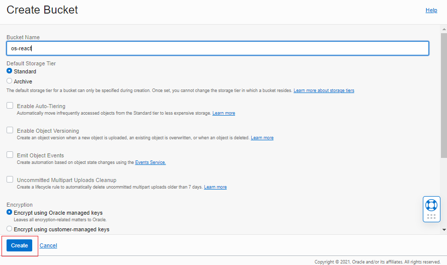  

3. Ubah visibility bucket dengan menekan tombol Edit Visibility, dan ubah menjadi public. Tekan tombol Save Changes untuk menyimpan perubahan.  
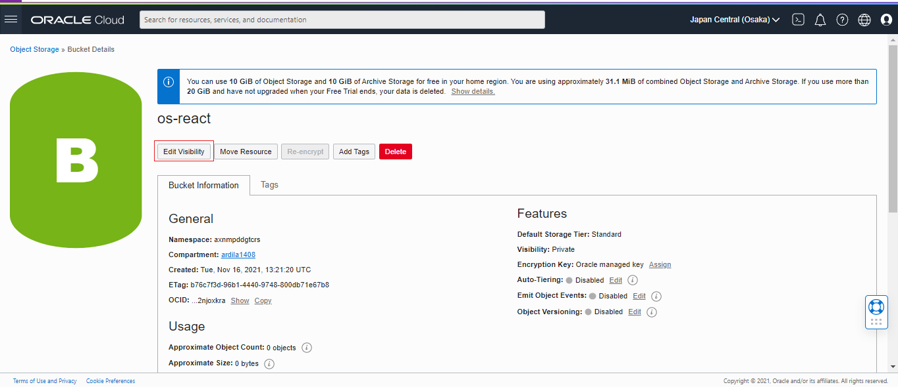 
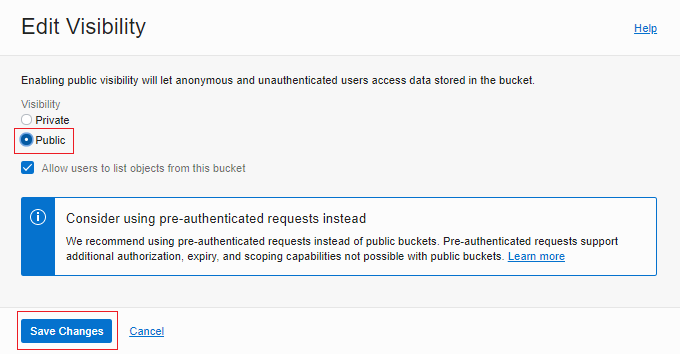  

4. Pada dashboard bucket, perhatikan nilai Namespace. Nilai ini nanti akan digunakan untuk pengaturan deployment.  
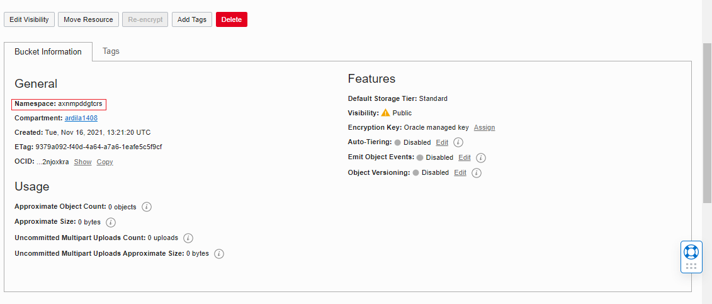 

### 1.2. Menyiapkan Project
1. Pada praktikum ini, akan digunakan React sehingga harus diinstall terlebih dahulu Node. Untuk  langkah  instalasi  Node  silahkan  gunakan  tautan  berikut  sebagai  referensi https://nodejs.org/en/download/ atau https://nodejs.org/en/download/package-manager/.  
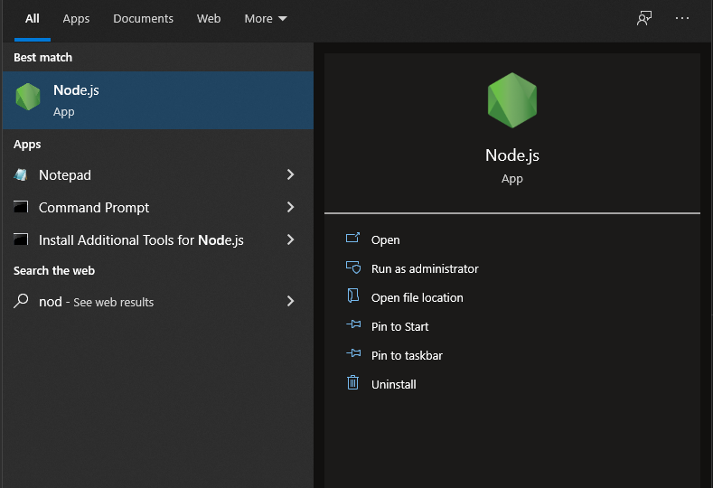 

3. Setelah Node terinstall, silahkan lakukan Langkah generate project dengan menggunakan perintah berikut.  
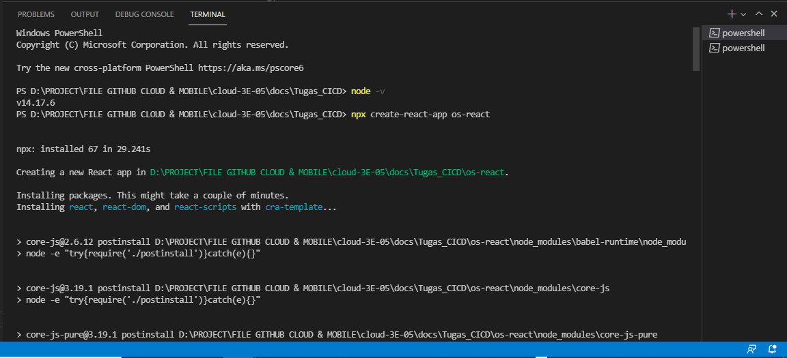 
y
4. Buatlah repository pada GitHub kemudian push project tersebut ke dalam repository.  
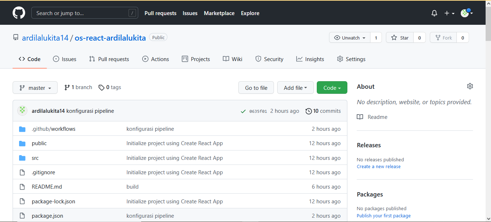 
 
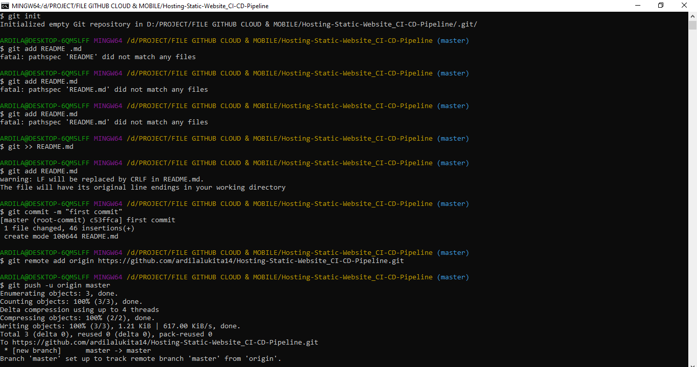 
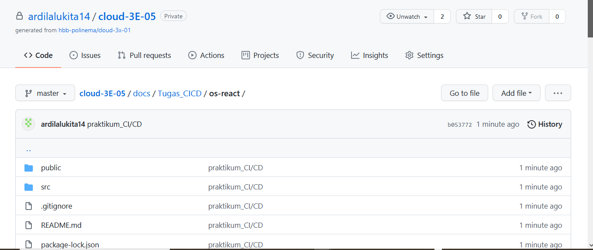 

### 1.2. Menambahkan GitHub Workflow
1. Pipeline  CI/CD  pada  GitHub  dibuat  dengan format  yaml  dan  diletakkan  pada  lokasi .github/workflows.  Buatlah  file  yaml  pada  lokasi  tersebut,  sebagai  ilustrasi  silahkan perhatikan filename berikut. 
 
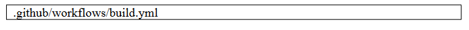 
 
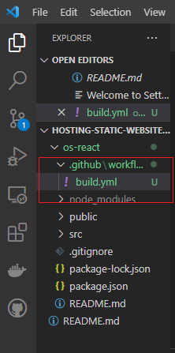 

2. Salin konfigurasi pipeline berikut. 
 
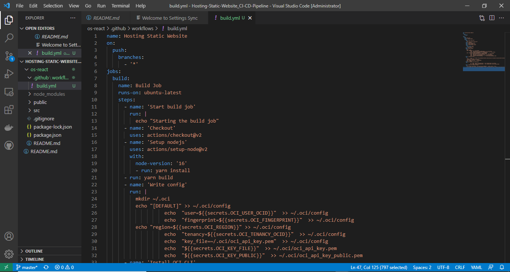 

3. Pada  pengaturan  pipeline,  terdapat  nilai  secrets  yang  diatur  melalui  pengaturan  pada 
repository GitHub. 

4. Buka alamat repository GitHub, dan masuk ke menu Settings -> Secrets. 
 
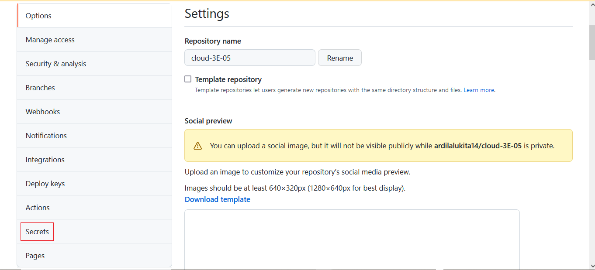 

5. Sebagai panduan, silahkan gunakan table berikut untuk pengisian secrets. 
 
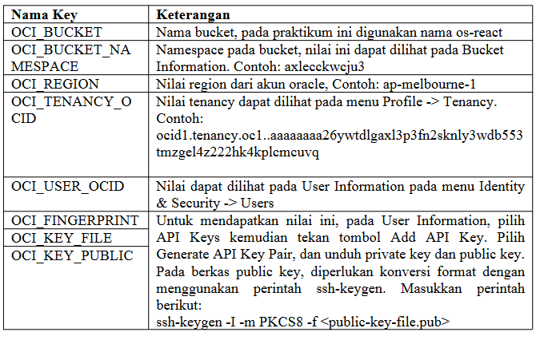 

### 2. Deploy Simple Website Menggunakan Docker CI/CD Pipeline

Pada praktikum ini akan dilakukan proses deploy pada OCI Compute dengan menggunakan 
docker. Pada Langkah di bawah mengasumsikan telah dibuat VCN dengan akses pada port HTTP 
(80). Selain itu diasumsikan telah mempunyai akun docker hub.

### 2.1. Menyiapkan Project Repository

a. Buat baru project React dengan memasukkan perintah. 
 
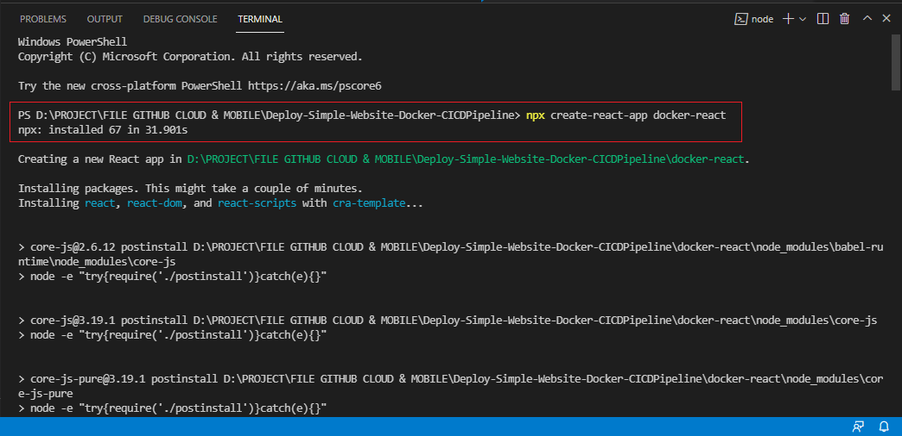 

b. Buatlah project baru pada GitHub, dan push project React tersebut.br>
 
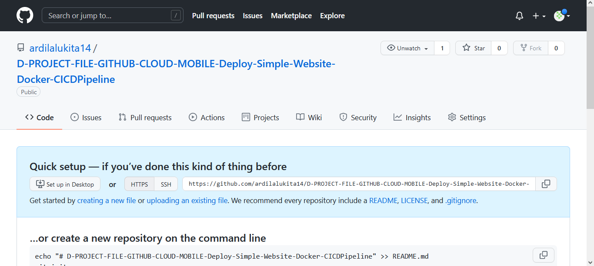 

### 2.2. Menyiapkan Akses Docker Hub
a. Silahkan login pada akun Docker pada https://hub.docker.com 
 
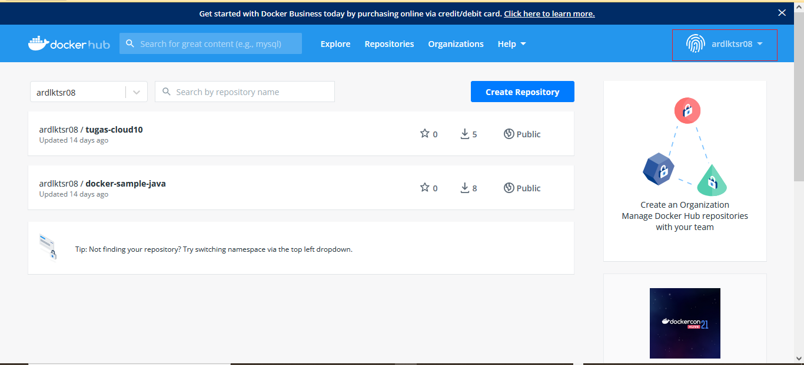 

b. Untuk memberikan akses push ke dalam registry, perlu dibuat Access Token. Silahkan 
masuk  pada  halaman  https://hub.docker.com/settings/security  kemudian  tekan  tombol 
New Access Token. 
 
 

c. Masukkan GitHub Actions pada nama token, simpan nilai token yang telah didapatkan. 
 
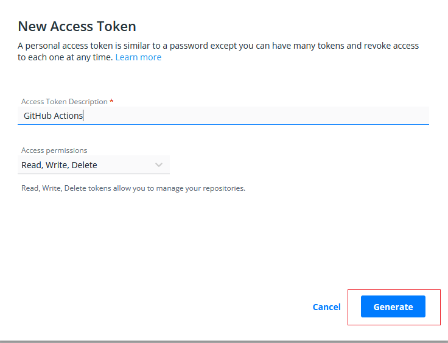 
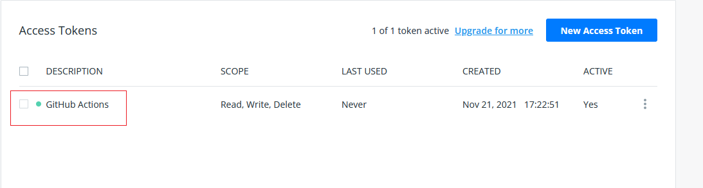 

### 2.3. Menambahkan GitHub Workflow

1. a. Buat sebuah file dengan berkas yaml, pada lokasi .github/workflows/deploy.yml. 
 
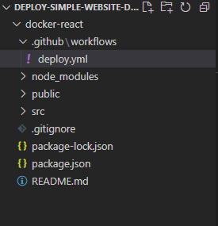 

2. Unduh  konfigurasi  berkas  pada  tautan  https://github.com/dhanifudin/hello-react-
docker/raw/master/.github/workflows/deploy.yml dan simpan pada lokasi tersebut. 
 
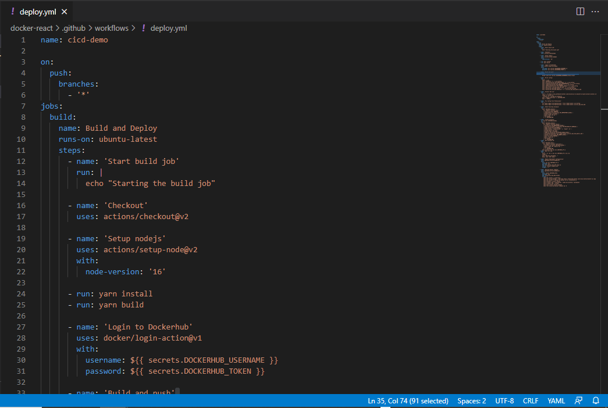 

3. Tambahkan nilai-nilai secrets yang terdapat pada GitHub Workflow tersebut. Untuk nilai 
yang diawali prefix OCI_ dapat digunakan table sebelumnya sebagai referensi. 
 
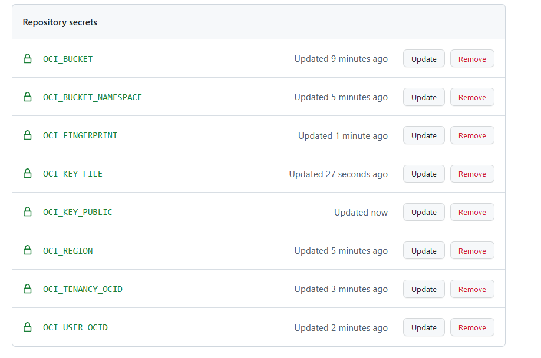 