# 12 - CI/CD

1. Student can understand about CI/CD
2. Student can create pipeline
3. Student  can  understand  about  variables,  secrets 
and token.

#
# Praktikum

#

### 1. Hosting Static Website Menggunakan CI/CD Pipeline Pada praktikum yang pertama akan dilakukan hosting static website di layanan Object Storage dari Oracle menggunakan GitHub Actions.

### 1.1. Menyiapkan Bucket Object Storage 

1. Masuk ke akun https://cloud.oracle.com dan navigasi ke menu Storage -> Buckets  
  

2. Tekan tombol Create Bucket, dan lengkapi Bucket Name dengan os-react. Biarkan nilai lainnya dengan nilai default kemudian tekan tombol Create.  
  

3. Ubah visibility bucket dengan menekan tombol Edit Visibility, dan ubah menjadi public. Tekan tombol Save Changes untuk menyimpan perubahan.  
 
  

4. Pada dashboard bucket, perhatikan nilai Namespace. Nilai ini nanti akan digunakan untuk pengaturan deployment.  
 

### 1.2. Menyiapkan Project
1. Pada praktikum ini, akan digunakan React sehingga harus diinstall terlebih dahulu Node. Untuk  langkah  instalasi  Node  silahkan  gunakan  tautan  berikut  sebagai  referensi https://nodejs.org/en/download/ atau https://nodejs.org/en/download/package-manager/.  
 

2. Setelah Node terinstall, silahkan lakukan Langkah generate project dengan menggunakan perintah berikut.  
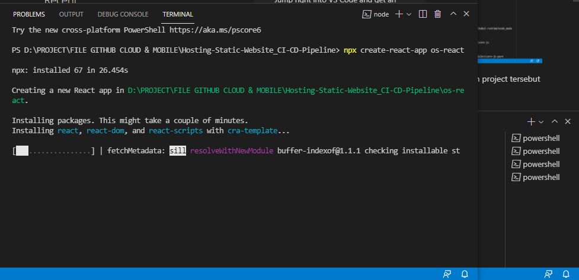 

3. Buatlah repository pada GitHub kemudian push project tersebut ke dalam repository. 
 
 
 
### 1.2. Menambahkan GitHub Workflow
1. Pipeline  CI/CD  pada  GitHub  dibuat  dengan format  yaml  dan  diletakkan  pada  lokasi .github/workflows.  Buatlah  file  yaml  pada  lokasi  tersebut,  sebagai  ilustrasi  silahkan perhatikan filename berikut. 
 
 
 
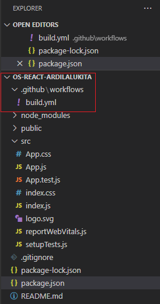 

2. Salin konfigurasi pipeline berikut. 
 
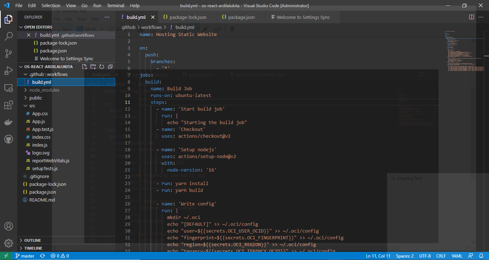 

3. Pada  pengaturan  pipeline,  terdapat  nilai  secrets  yang  diatur  melalui  pengaturan  pada 
repository GitHub. 

4. Buka alamat repository GitHub, dan masuk ke menu Settings -> Secrets. 
 
 

5. Sebagai panduan, silahkan gunakan table berikut untuk pengisian secrets. 
 
 

6. Lengkapi nilai semua secrets yang dibutuhkan. Kemudian push perubahan ke repository 
GitHub.
Berikut hasil konfigurasi nilai secrets : 
 
 

7. Perhatikan tab Actions pada halaman repository. Cek hasil proses deployment apakah terdapat kesalahan. Jika terjadi kesalahan, koreksi kembali nilai secrets yang dimasukkan.

    Disini kita coba untuk push file <b>build.yml</b> yang nantinya akan membantu memeriksa keberhasilan proses deploy  
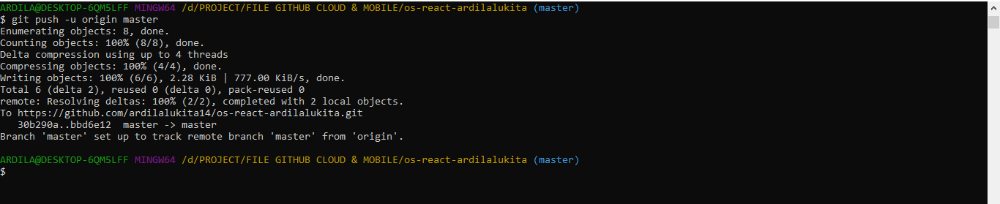 
    Jika berhasil, maka tampilan pada tab actions akan seperti berikut:  
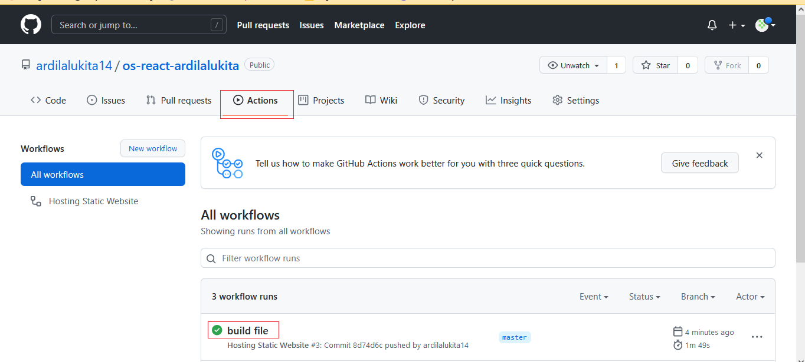 

8. Jika proses deployment sudah mendapatkan tanda centang hijau,silahkan kembali ke dashboard bucket object storage. Centang berkas index.html, kemudian tekan menu titik tiga dan pilih View Object Details. Perhatikan URL Path dengan pola sebagai berikut https://objectstorage.<region>.oraclecloud.com/n/<namespace>/b/<bucket-name>/o/index.html.  
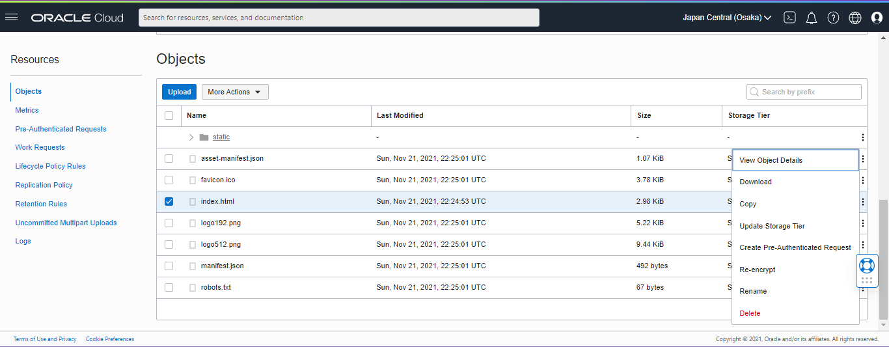 
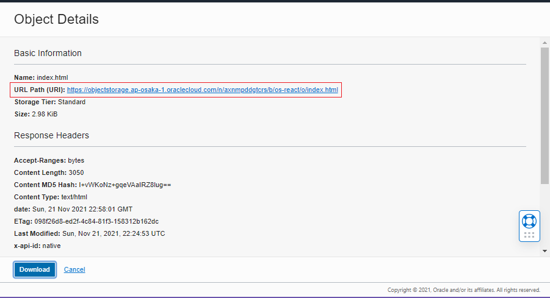 

9. Salin URL Path tanpa nilai index.html, kemudian buka kembali project React. Cari berkas 
package.json  dan  tambahkan  key  “homepage”  dengan  nilai  URL  Path  pada  Object 
Details. Ilustrasi berkas hasil akhir package.json dapat dilihat sebagai berikut.  
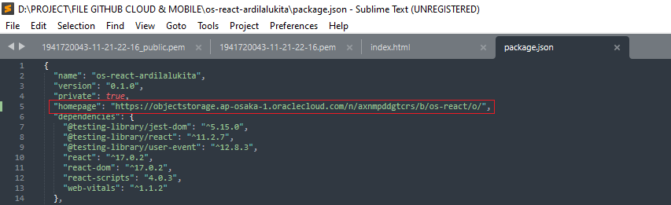 

<b>Hasil : </b>
  
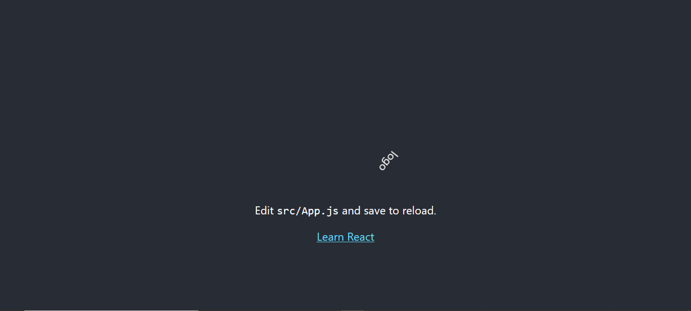  

### 2. Deploy Simple Website Menggunakan Docker CI/CD Pipeline

    Pada praktikum ini akan dilakukan proses deploy pada OCI Compute dengan menggunakan 
    docker. Pada Langkah di bawah mengasumsikan telah dibuat VCN dengan akses pada port HTTP 
    (80). Selain itu diasumsikan telah mempunyai akun docker hub.

### 2.1. Menyiapkan Project Repository

a. Buat baru project React dengan memasukkan perintah. 
 
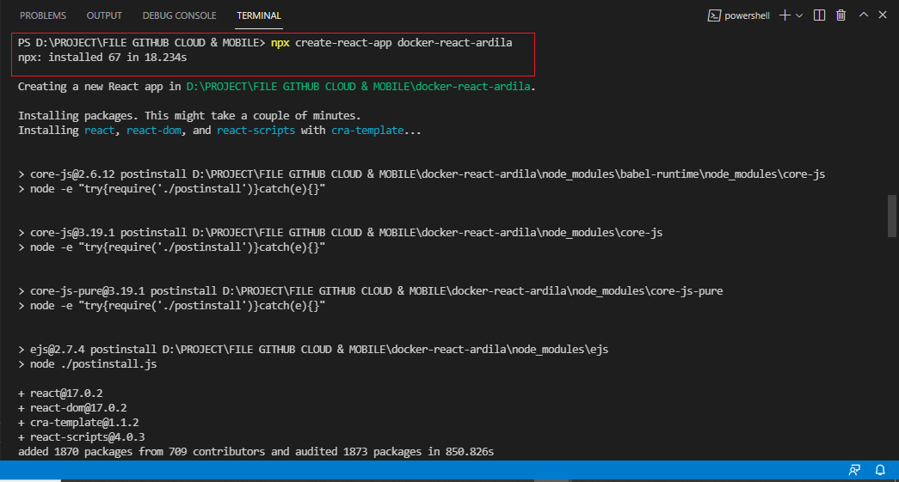 

b. Buatlah project baru pada GitHub, dan push project React tersebut. 
 
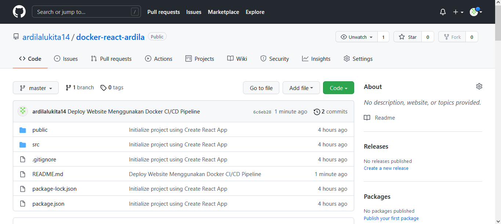 

### 2.2. Menyiapkan Akses Docker Hub
a. Silahkan login pada akun Docker pada https://hub.docker.com 
 
 

b. Untuk memberikan akses push ke dalam registry, perlu dibuat Access Token. Silahkan 
masuk  pada  halaman  https://hub.docker.com/settings/security  kemudian  tekan  tombol 
New Access Token. 
 
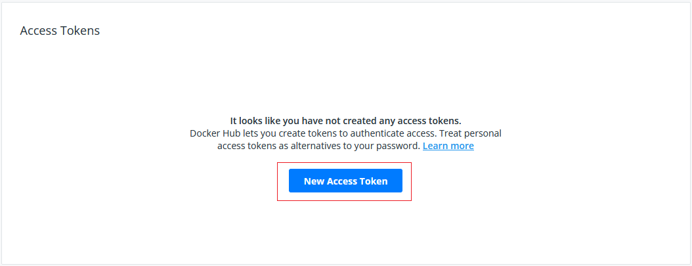 

c. Masukkan GitHub Actions pada nama token, simpan nilai token yang telah didapatkan. 
 
 
 

### 2.3. Menambahkan GitHub Workflow

1. a. Buat sebuah file dengan berkas yaml, pada lokasi .github/workflows/deploy.yml. 
 
 

2. Unduh  konfigurasi  berkas  pada  tautan  https://github.com/dhanifudin/hello-react-
docker/raw/master/.github/workflows/deploy.yml dan simpan pada lokasi tersebut. 
 
 

3. Tambahkan nilai-nilai secrets yang terdapat pada GitHub Workflow tersebut. Untuk nilai 
yang diawali prefix OCI_ dapat digunakan table sebelumnya sebagai referensi. 
 
 

4. Perhatikan table berikut sebagai referensi untuk pengisian nilai secrets. 
 
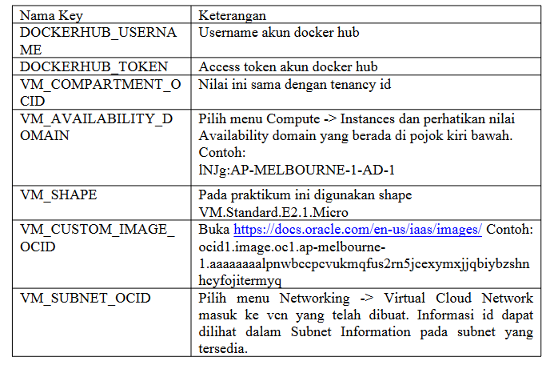 
 

### 2.4. Menyiapkan Dockerfile

1. Buatlah  berkas  dengan  nama  Dockerfile.  Gunakan  tautan  berikut.
https://github.com/dhanifudin/hello-react-docker/blob/master/Dockerfile  sebagai template.
2. Pastikan penamaan berkas sudah sesuai. 
 
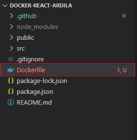 
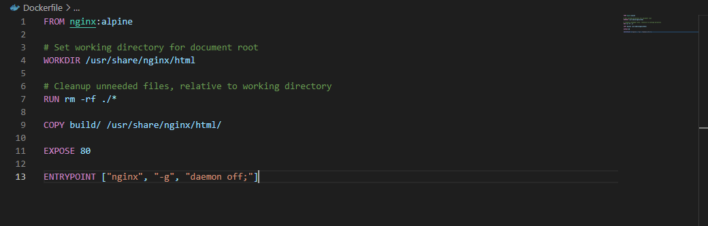 

### 2.5. Menyiapkan Docker Compose

1. Buatlah berkas dengan nama docker-compose.yml. 
 
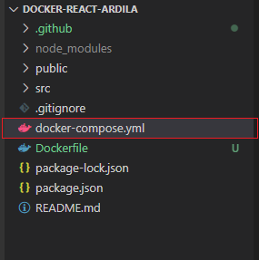 
2. Gunakan  tautan  https://github.com/dhanifudin/hello-react-docker/blob/master/docker-
compose.yml sebagai referensi untuk membuat docker-compose.yml. Jangan lupa untuk 
mengubah nilai image sesuai dengan username docker hub. 
 
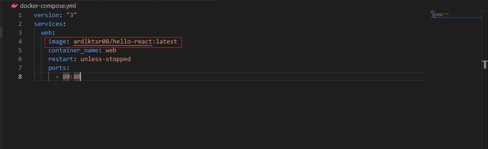 

### 2.6. Melakukan Deployment

1. Setelah  berkas  deployment  dan  nilai  secrets  telah  selesai  diatur,  lakukan  push  ke repository. 
 
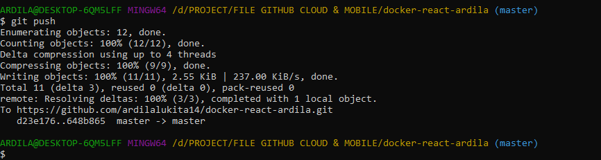 

2. Amati log deployment pada tab Actions, dan pastikan proses menghasilkan tanda centang 
hijau. Jika terjadi error, periksa kembali konfigurasi dan nilai secrets yang dimasukkan.  
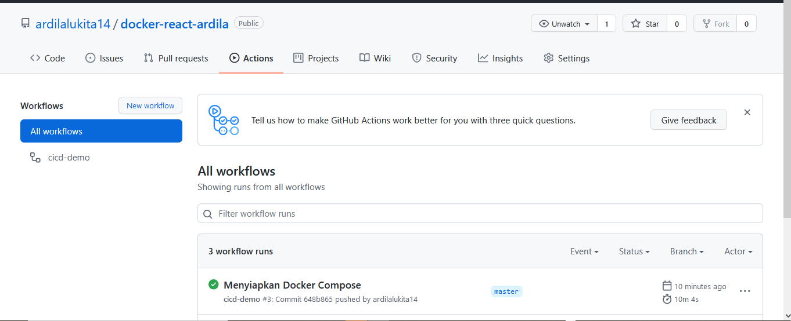 

3. Setelah  proses  deployment  berhasil,  untuk  mendapatkan  nilai  IP  public  yang  dapat diakses silahkan masuk ke dashboard pada halaman Compute Instances. 
 
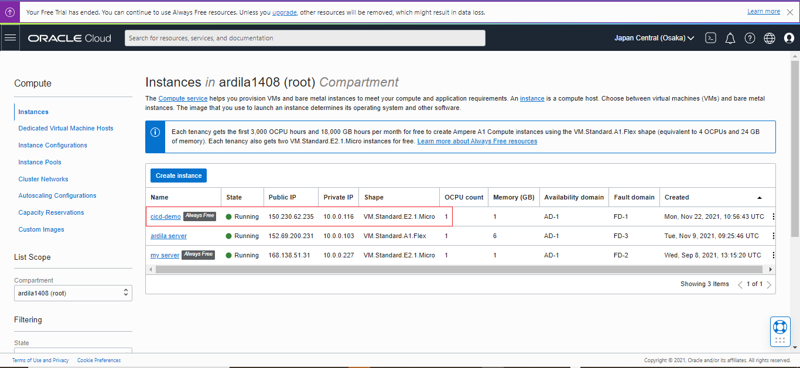 

4. Pada hasil akhir, jika tidak terdapat kesalahan akan didapatkan halaman website seperti pada gambar berikut. 
 
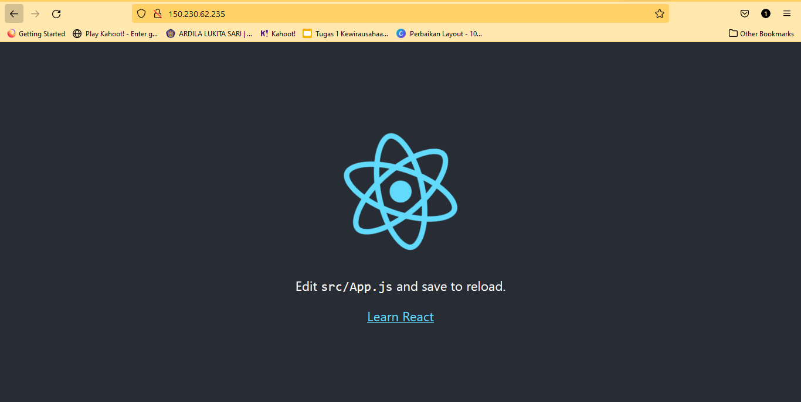 