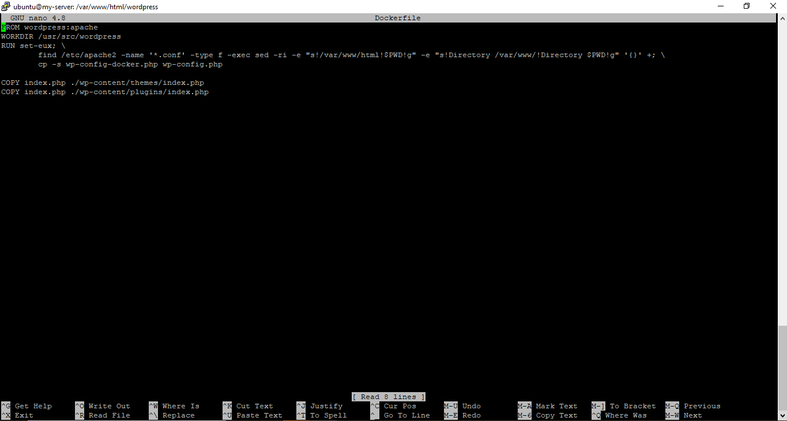
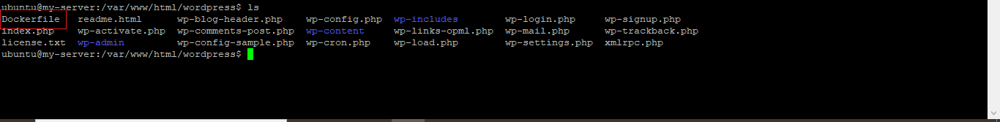
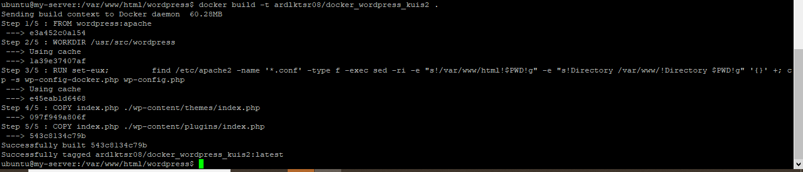
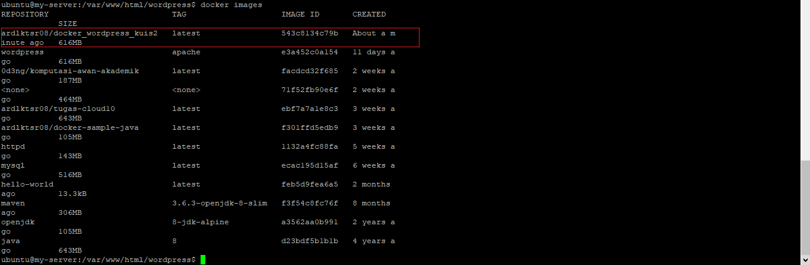
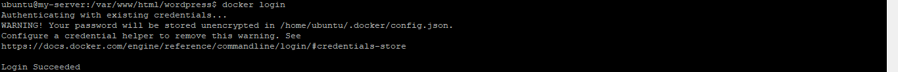
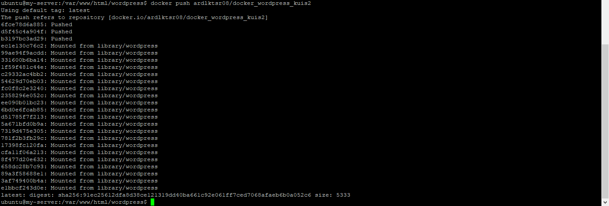
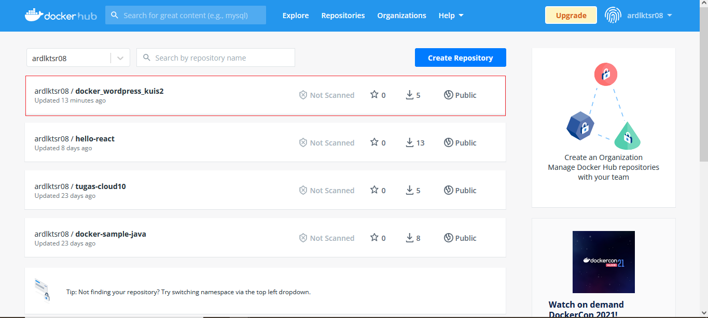

# KUIS 2 - CLOUD

# SOAL

1. Buatlah docker image dari project UTS kemarin di push ke docker hub.

#

# JAWAB

Dikarenakan pada UTS kemarin sudah berhasil memanfaatkan VM, DB instance, dan juga Object Storage di dalam wordpress, maka untuk menyelesaikan soal Kuis 2 ini, kita langsung saja build image untuk project yang berhasil ter-create pada UTS kemarin. Berikut adalah langkah - langkah detailnya.

#

# LANGKAH PENGERJAAN

1. Kita tambahkan file <b>Dockerfile</b> ke dalam project wordpress dengan menggunakan perntah <b>sudo nano Dockerfile</b>.

2. Kemudian di dalamnya kita masukkan source code berikut.  
 

3. Jika sudah selesai, kita coba save, maka secara otomatis file <b>Dockerfile</b> berhasil tersimpan di dalam project wordpress.  
 

4. Selanjutnya, kita coba untuk build Dockerfile yang telah kita buat menjadi sebuah images. Berikut perintah yang harus kita jalankan.  
 

5. Jika proses build sudah berhasil dilakukan, maka sekarang kita bisa coba cek daftar image yang berhasil tersimpan di dalam server oracle dengan menjalankan perintah berikut, disini kita menastikan juga bahwa docker image yang baru kita build berhasil tersimpan.  
 

6. Sekarang kita bisa upload image yang telah kita buat ke dalam Docker. Namun, sebelumnya kita login terlebih dahulu dengan cara menjalankan perintah berikut.  
 

7. Jika sudah berhasil login, selanjutnya kita bisa upload image yang telah kita buat menggunakan perintah di bawah ini.  
 

8. Berikut tampilan yang menunjukkan bahwa image yang kita buat berhasil terupload di dalam repository Dockerhub.  
 
