# 14 - AUTOSCALLING

1. Mahasiswa bisa mengetahui cara konfigurasi instance	
2. Mahasiswa bisa mengetahui cara membuat instance pool
3. Mahasiswa bisa mengetahui cara konfigurasi Autoscalling

#
# Praktikum

### Membuat Konfigurasi Instance

#

1. Pada halaman detail instance, klik menu More Actions dan pilih Create Instance Configuration.  

    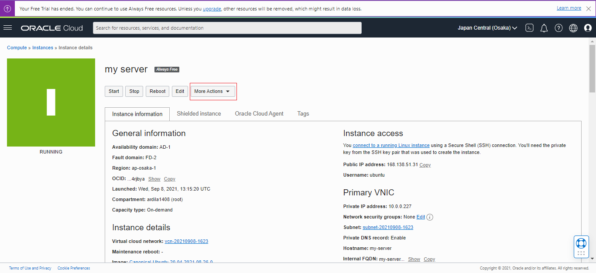 
    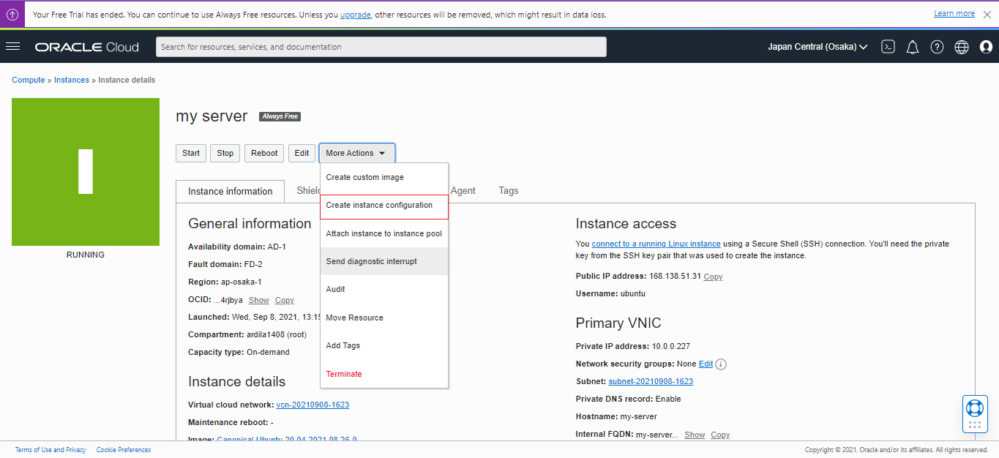  

2. Pilih kompartemen Anda. 
3.	Untuk nama, masukkan instance-config. 
4.	Click Create Instance Configuration.  

    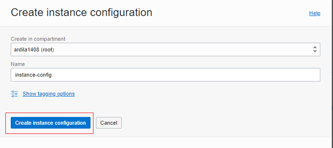 

5. Setelah Anda membuat konfigurasi instance, halaman detailnya akan ditampilkan, seperti yang ditunjukkan pada gambar berikut.  

    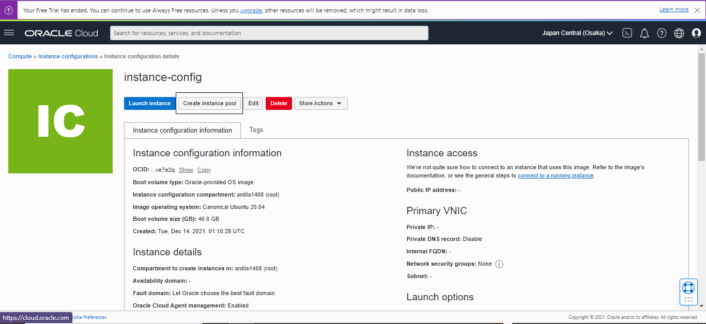 

#

### Membuat instance pool

#

1. Klik Create Instance pool.  

     

2.	Dari daftar Kompartemen, pilih kompartemen tempat Anda membuat konfigurasi instans. 

3.	Untuk nama, masukkan my-instance-pool. 

4.	Dari daftar Konfigurasi Instance, pilih instance-config. 

5.	Untuk number of instans, masukkan 1. Jumlah instans menunjukkan jumlah maksimum instans yang dapat disediakan di kolam instans. Jumlah instans yang dapat disediakan bergantung pada batas layanan penyewa Anda dan ketersediaan bentuk komputasi di wilayah Anda.  
    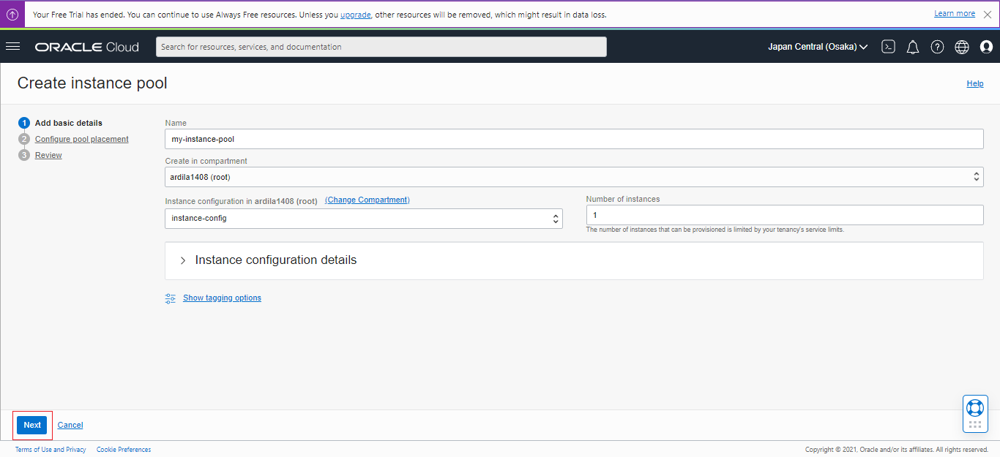 

6. Klik next. Untuk melanjutkan, pilih AD1 untuk availability domain, VCN dan subnet. Klik Next  dan kemudian Create  untuk membuat kolam instans.Untuk fault domain pilih FAULT-DOMAIN-1, FAULT-DOMAIN-2, FAULT-DOMAIN-3
Karena ada keterbatasan layanan penyewa nampaknya instance bisa dibuat hanya 1 buah.  
    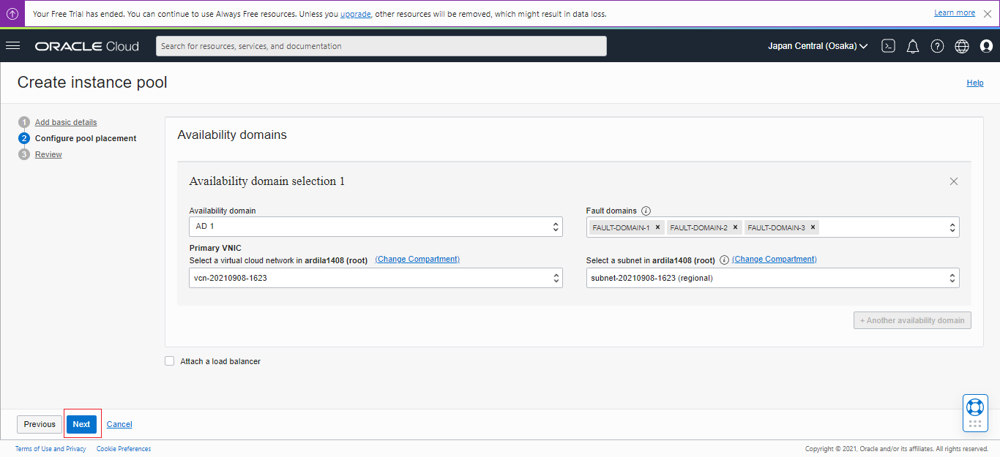 
    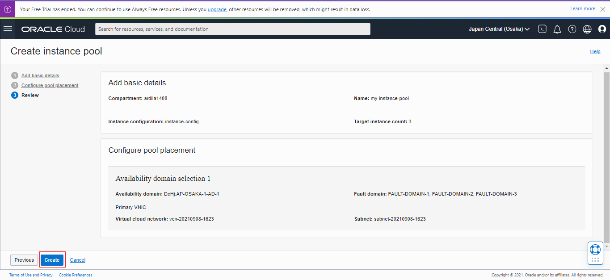 
    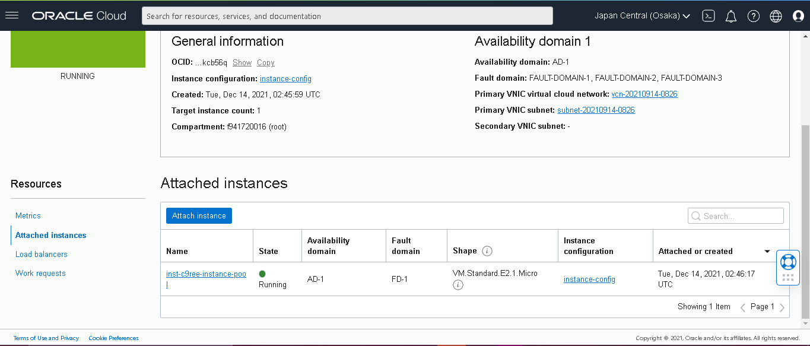 

#

### Membuat konfigurasi Autoscalling

#

1. Skenarionya adalah barangkali suatu saat instans yang ada tidak dapat menangani kebutuhan komputasi. Maka dibuat konfigurasi penskalaan otomatis yang secara otomatis menskalakan jumlah instans di kolom instance.

    Kita akan buat konfigurasi penskalaan otomatis dari halaman detail instance pool.

    1. Klik menu More Actions dan pilih Create Autoscaling Configuration.  
    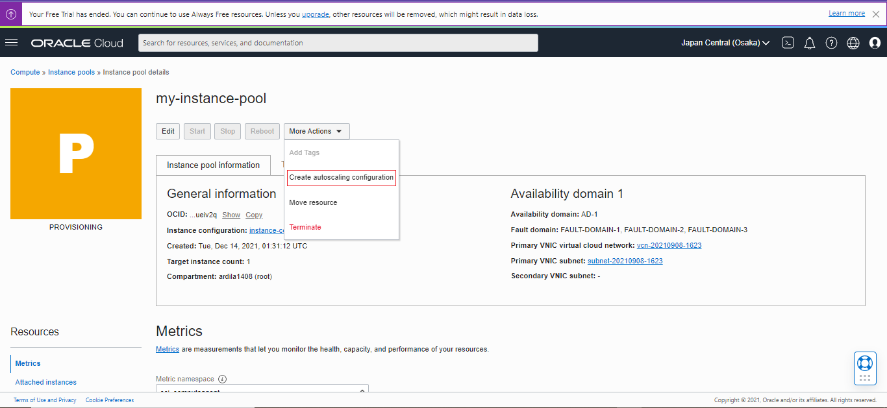 

    2.	Klik menu More Actions dan pilih Create Autoscaling Configuration.

    3.	Untuk nama, masukkan my-autoscaling-config.

    4.	Dari daftar Buat di kompartemen, pilih kompartemen tempat Anda membuat kumpulan instans.

    5.	Klik Next.  
    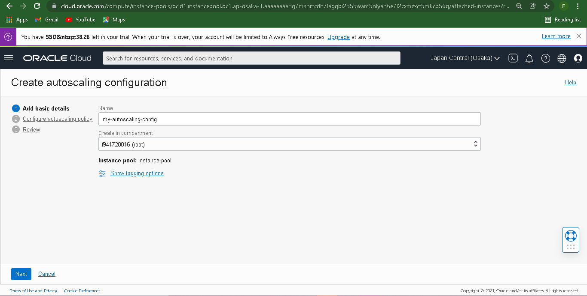 

    6. Pada halaman Configure Autoscaling Policy, Anda dapat memilih Metric-based Autoscaling atau Schedule-based Autoscaling.  
     
    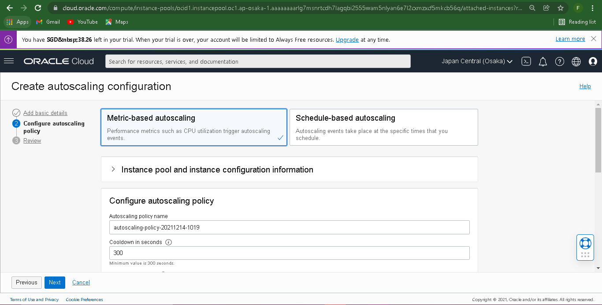 
    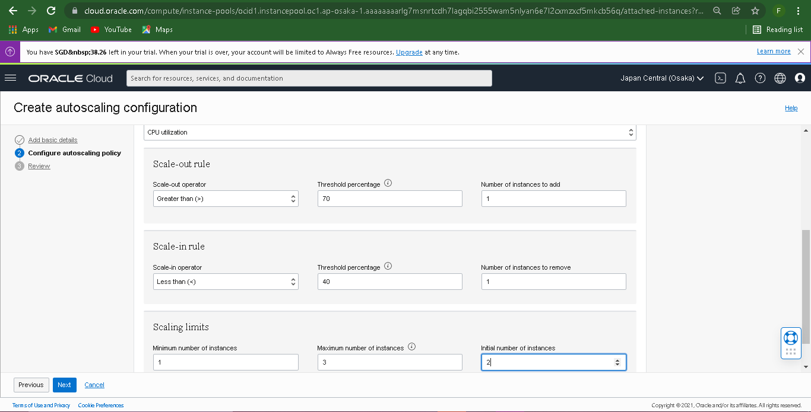 
    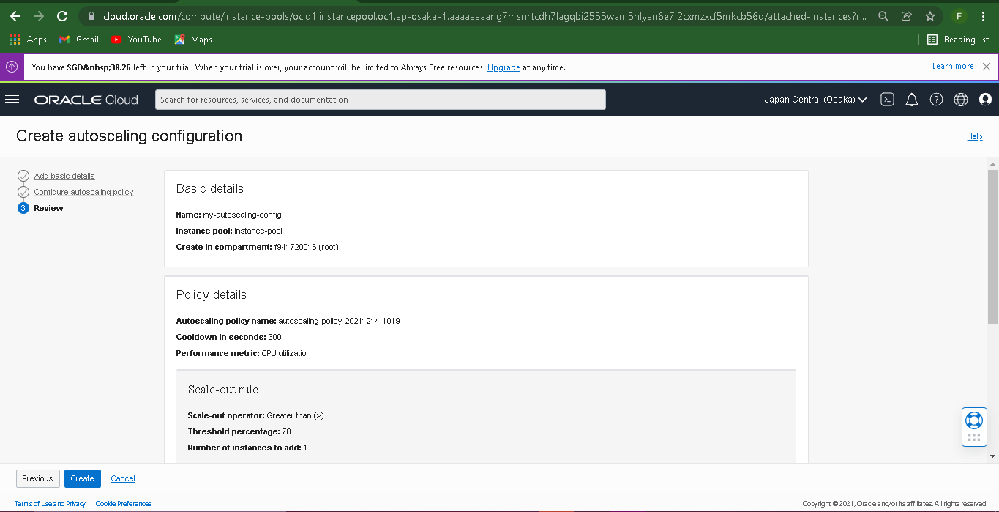 

    7. Setelah Anda mengonfigurasi Autoscalling policy, klik Create. Anda dapat menentukan beberapa konfigurasi penskalaan otomatis untuk kumpulan instance yang sama, dan Anda dapat mengaktifkan atau menonaktifkannya salah satunya. 
    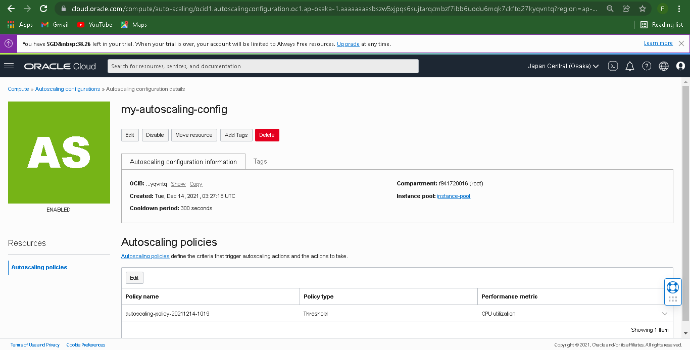 

#

### TUGAS
#

1. elaskan Apa kaitan Autoscalling dengan Availability? 
Jawab   :  
Bisa kita simpulkan kaitan antara Autoscalling dengan Availability ialah sesuai dengan pengertiannya yangmana bahwasanya autoscalling ialah kemampuan dalam menghandle variasi kebutuhan infrastruktur komputasi, maka dari itu untuk bisa menghandle variasi kebutuhan ini tentu perlu adanya ketersediaan domain yang mempuni, oleh sebab itu dengan adanya avaibility ini setidaknya proses autoscalling ini bisa berjalan dengan baik karena keberadaan avaibility inilah yang nantinya akan membantu proses yang nantinya akan membantu proses konfigurasi fault domain, primary virtual cloud network (VCN), dan subnet, yang mana secara default, instance dalam kolom didistribusikan di semua fault domain. Selain itu, di dalam avaibility ini nantinya juga akan ada pemeriksaan, jika kapasitas tidak tersedia di satu fault domain, instans ditempatkan di fault domain lain untuk memungkinkan kumpulan instans berhasil diluncurkan. Dengan kondisi instans yang berhasil diluncurkan ini, maka kemampuan autoscalling juga akan berjalan sempurna.

